[..](../index.html)

# Tile-based dungeon generation

This is a project I made about a year ago. It is programmed in Python with the `PIL` module to generate the images. Some of the code is pretty bad, but the results look cool so I wanted to document it a bit.

It is kind of similar to the Wave Function Collapse algorithm in the way certain tiles can only be placed next to other certain tiles. I didn't know about WFC before programming this, so I came up with the algorithm that is used here (*while it may probably already exist*).

## Simplified code and algorithm

`spawntile(tile, position)` is a recursive function that spawns other tiles.
For each connexion of the spawned tile, it tries to check if a tile fits after the connexion. For this, it chooses a random tile from the `tiles` list and checks if it works, until it finds one. If it doesn't find any fitting tile after `randomTries` tries, it gives up.
This method of iterating over the spawned tile's connexions implies that when we spawn a tile with two connexions available, it will create new tiles starting from one of the two connexions first, then proceed with the second connexion.


```python
dungeon = matrix of empty lists

def checkTileFit(tile, basePosition, connexion):
    if (there isnt already a tile where we want to spawn the next tile):
        tilesCopy = tiles.copy()
        for _ in range(randomTries): # try to get a matching tile
            candidateTile = random tile from tilesList
            remove candidateTile from tilesList
            if (connexions match between the base tile and the candidate tile):
                spawnTile(candidateTile, getRelativeTilePosition(tile, connexion))

def spawnTile(tile, position):
    dungeon[position.x][position.y] = tile
    drawTileOnImage(position, tile.image)
    for connexion in tile.connexions:
        checkTileFit(tile, position, connexion)
```

This is a **very** simplified version of the algorithm but explaining it in the very details wouldn't be necessary.

## Maze of tiles

Heres are the basic tiles I first made: the yellow part is a wall, and the black part is "empty". Instead of drawing every rotation of each tile by hand, I rotated them in the code using `PIL`.

   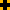

Each tile is represented as a class having two members: `tile.image` and `tile.connexions`, the latter being a list that can contain the strings `"left"`, `"right"`, `"up"` and `"down"`. *For sure this could have been optimized with another structure, like a bitset, but this was only to test things out.*

A list of every possible tile (including their rotations, which count as separate tiles) is kept as a `tiles` list. Some tiles can be added multiple times to `tiles` to give them more probability to be chosen randomly.

First working iterations gave these images:

<figure style="display: inline-block">
   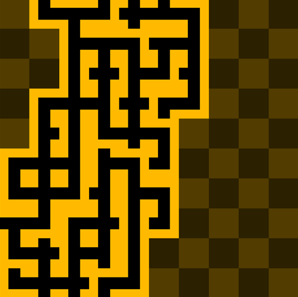
   <figcaption>added a checkerboard</figcaption>
</figure>
<figure style="display: inline-block">
   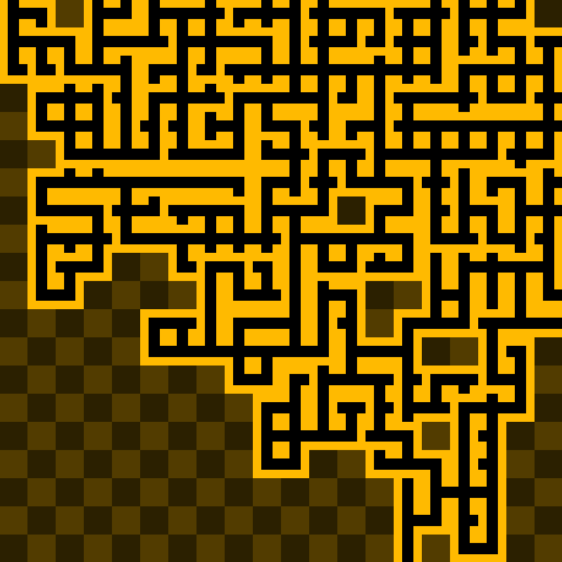
   <figcaption>more tiles</figcaption>
</figure>

I later added these tiles to the tileset:  

<figure style="display: inline-block">
   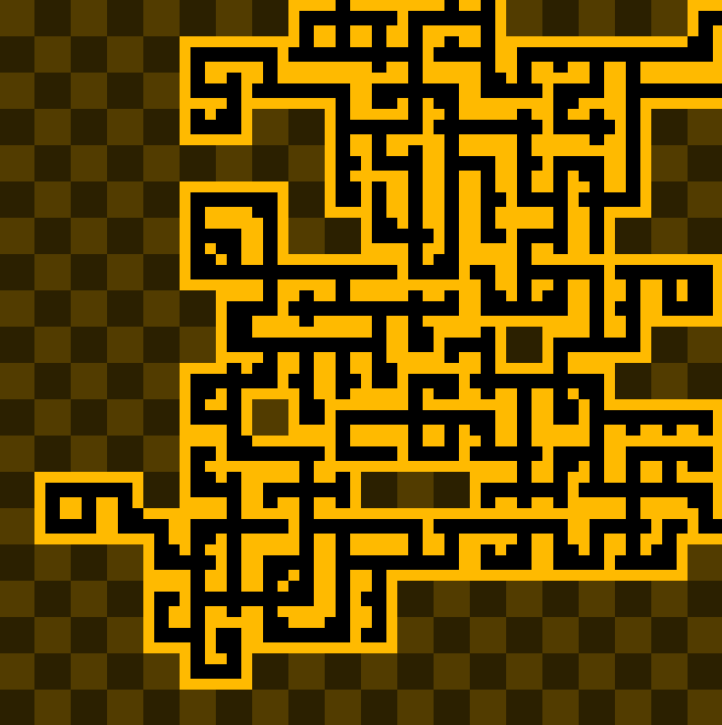
   <figcaption>lots of variation</figcaption>
</figure>
<figure style="display: inline-block">
   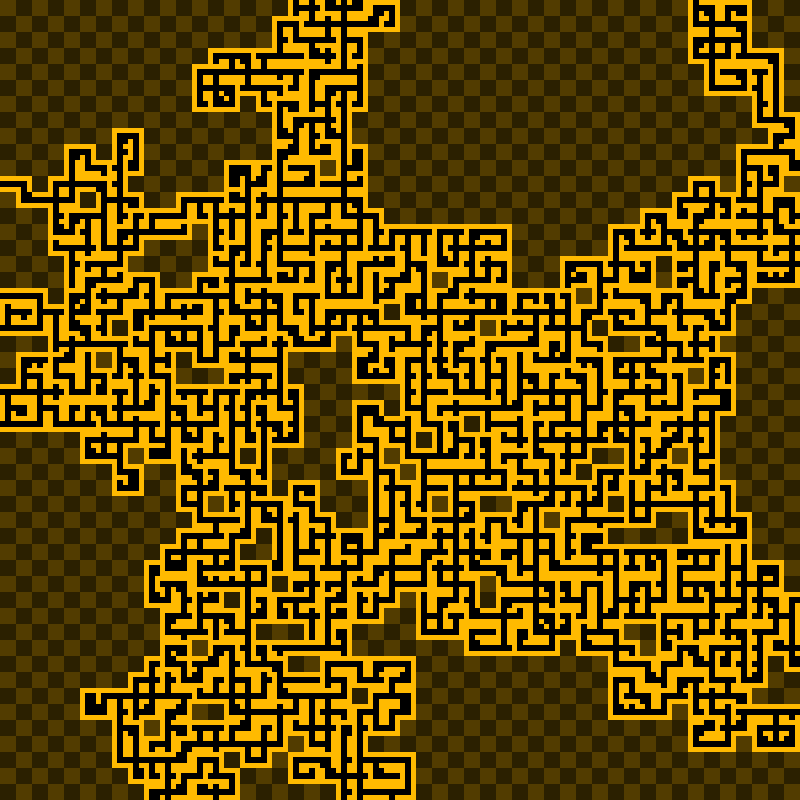
   <figcaption>larger generation</figcaption>
</figure>

I finally added the last tiles to the tileset: 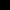 

The "empty" one has four connexions, and therefore helps to generate sort of large "room" spaces. I also quickly wrote a function to generate multiple images in a row, so from now on a random color tint is applied to the tiles for variation.

<figure style="display: inline-block">
   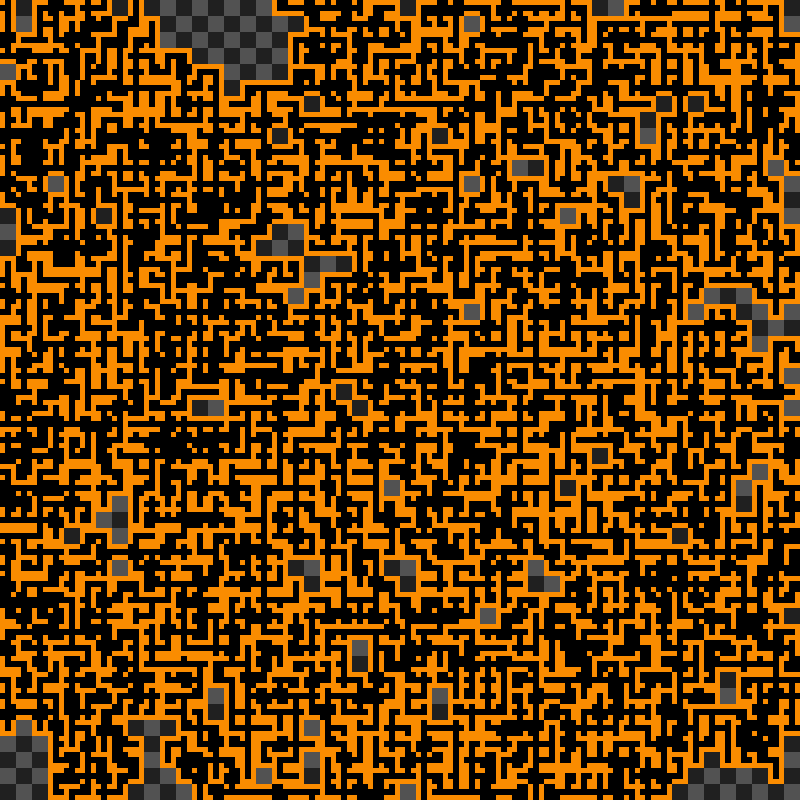
   <figcaption>little rooms</figcaption>
</figure>
<figure style="display: inline-block">
   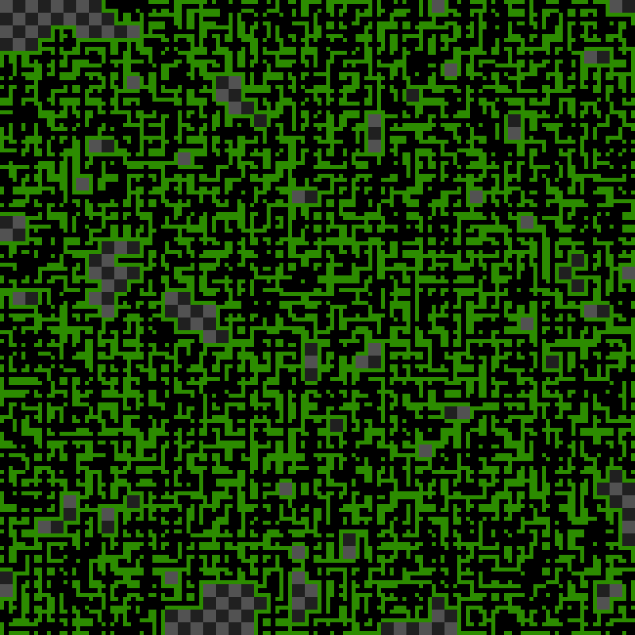
   <figcaption>not a hedge maze</figcaption>
</figure>

I played a bit with the fact that you can add the same tile multiple times to the `tiles` list.
Adding more "empty" tiles makes it so you can increase the size of the "rooms". But this is very uncontrollable, and I still didn't find a way to properly detect certain tiles as being part of a room.

Adding more "dead end" tiles make the mazes end sooner.

<figure style="display: inline-block">
   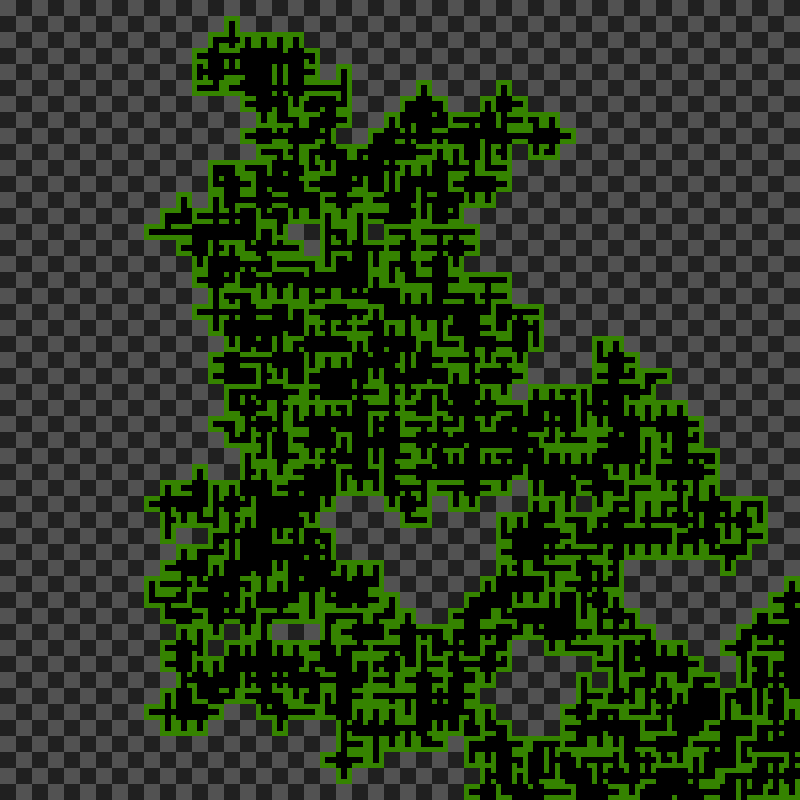
   <figcaption>a bit larger rooms</figcaption>
</figure>
<figure style="display: inline-block">
   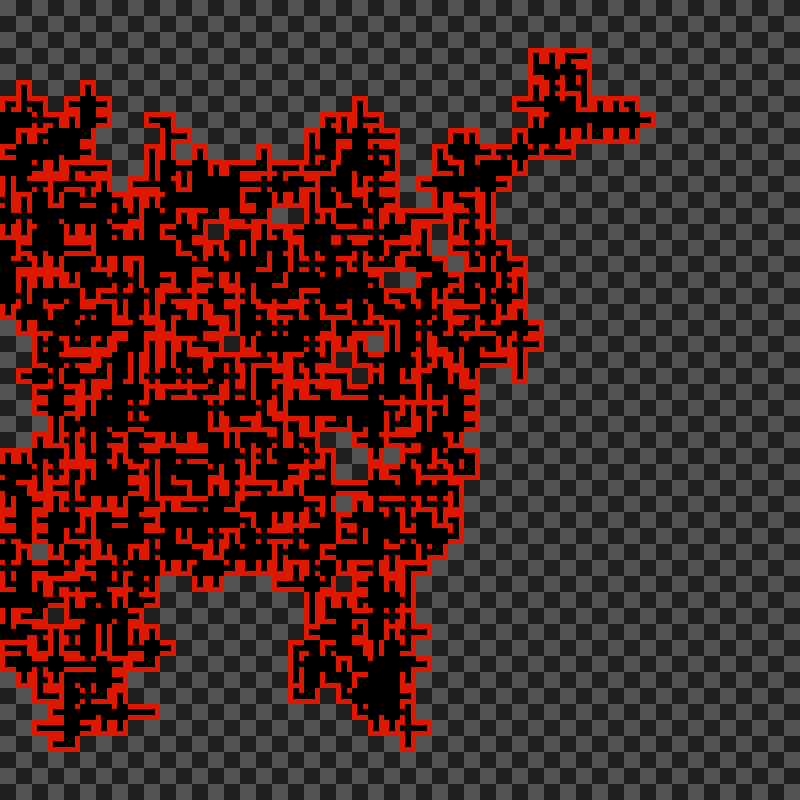
   <figcaption>everything ends in a dead end</figcaption>
</figure>

Some of them turned out very small! These were due to random.

<figure style="display: inline-block">
   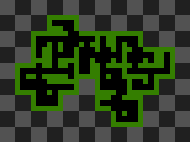
   <figcaption>very small</figcaption>
</figure>
<figure style="display: inline-block">
   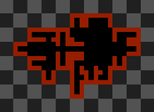
   <figcaption>it reminds me of a bar room</figcaption>
</figure>

So I tried adding more "dead end" tiles... Which resulted in somewhat smaller mazes. The size could have been more controllable, for example by checking if a maze is growing out of a bounding box and replacing every tile by a closing tile. This wasn't implemented yet though.

<figure style="display: inline-block">
   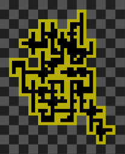
</figure>
<figure style="display: inline-block">
   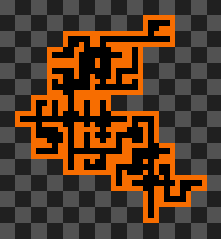
</figure>
<figure style="display: inline-block">
   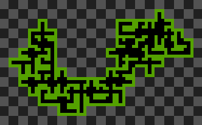
</figure>

And even smaller ones:

<figure style="display: inline">
   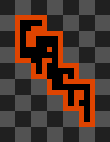
</figure>
<figure style="display: inline">
   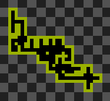
</figure>
<figure style="display: inline">
   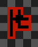
</figure>

## Algorithm visualization with FFMPEG

I decided to generate videos to show the steps of the algorithm. I changed the Python script to save the image in a separate `"steps"` folder every time a new tile is drawn. It also accepts arguments to change the grid size, and the ratio of "dead end" and "empty" tiles.
<figure style="display: inline-block">
   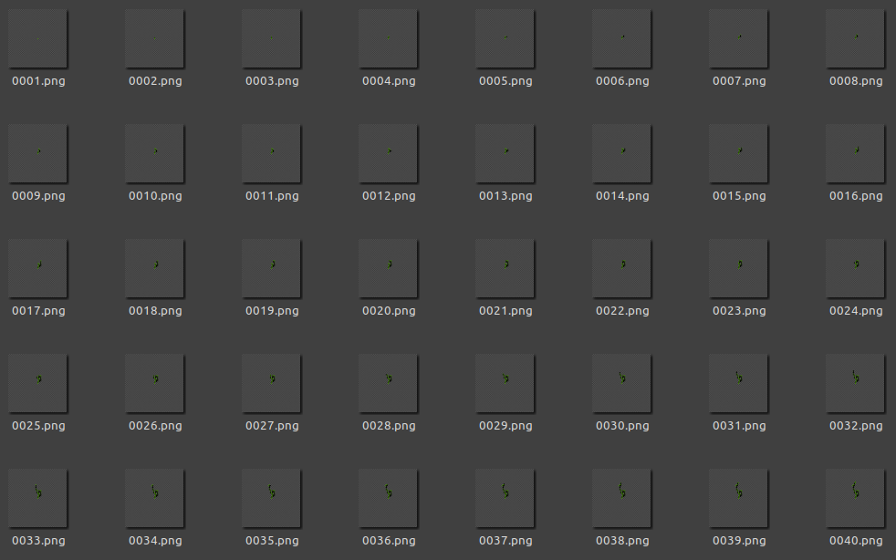
</figure>

Then, I wrote a short Bash script to generate a video compiling all the images. The examples shown below have been converted to GIFs.
```bash
#!/usr/bin/env bash
# gensteps.sh name gridfactor endRatio emptyRatio fps

python3 'dungen steps.py' $2 $3 $4

BACK_PID=$!
wait $BACK_PID      # waits until the most recent process has ended

ffmpeg -framerate $5 -i "steps/%04d.png" outputs/output$1.mp4

BACK_PID=$!
wait $BACK_PID

xdg-open outputs/output$1.mp4
```

<figure style="display: inline-block">
   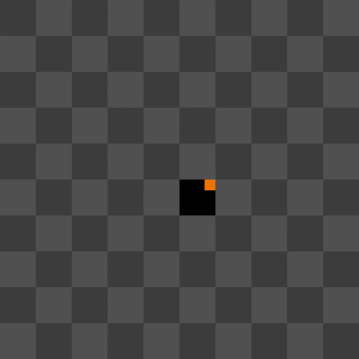
</figure>
<!-- <figure style="display: inline-block">
   
</figure> -->

On a larger scale, it's interesting to see all the directions it takes before finally coming back to the original tile to start from another connexion.

<figure style="display: inline-block">
   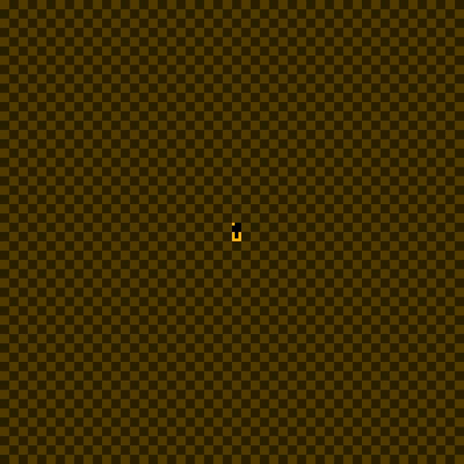
</figure>


## Implementation in Unity

I later tried to implement this algorithm in the Unity game engine. The tiles are a bit different.

<figure style="display: inline-block">
   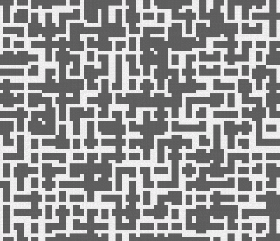
</figure>

Looking a bit closer, you can see this one generated small rooms, and not the typical maze we had in the Python version. This could have been interesting as a starting point to then "dig" holes in the walls to interconnect them, but I have absolutely no idea of how to go back to this version...

Here's a generated maze, obtained after fixing the algorithm.

<figure style="display: inline-block">
   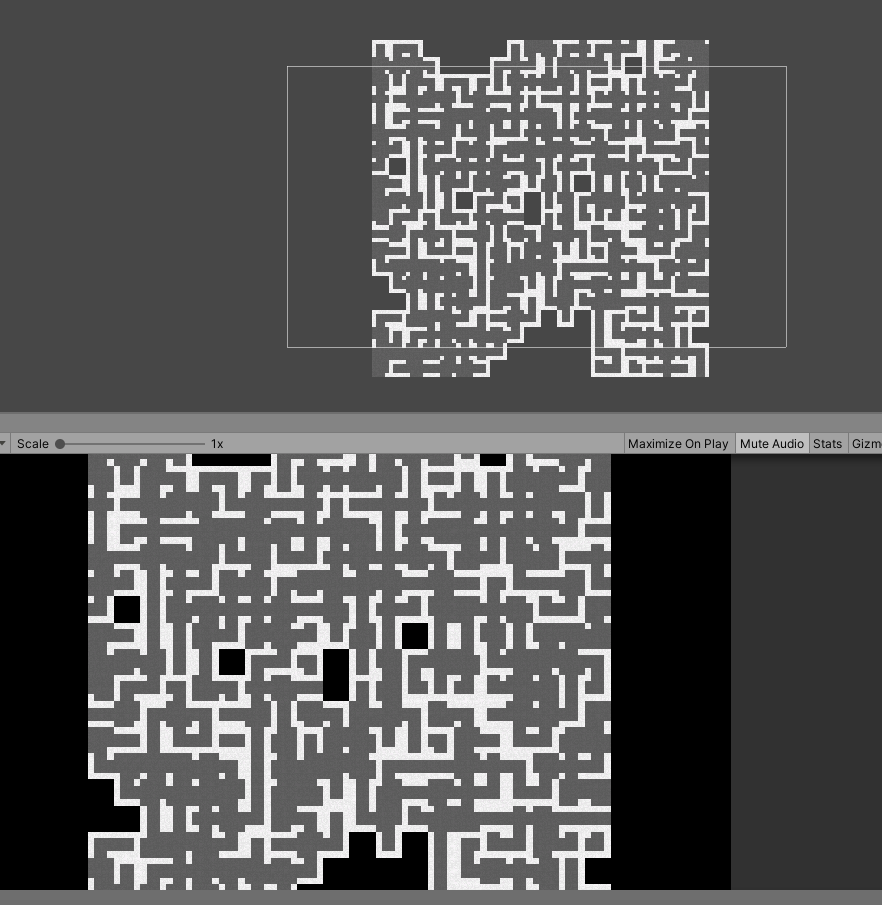
</figure>

The last thing I wanted to add was perspective. Or *kind of*.

<figure style="display: inline-block">
   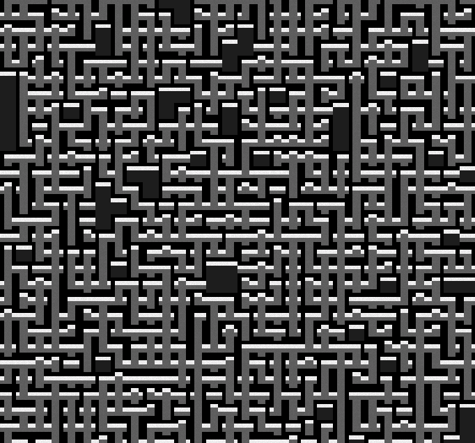
</figure>

Looking back I think this way of generating mazes would be more fitting for a metroidvania platforming type of game. Because for a top-down roguelike game, the space between the walls is either too small or too large, depending on the player size.

<figure style="display: inline-block">
   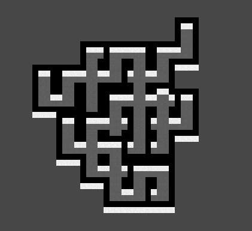
   <figcaption>very small one</figcaption>
</figure>


## Bonus: limiting the tileset

By only using certain tiles, we get weird results... This one was made only using "column" tiles.
<figure style="display: inline-block">
   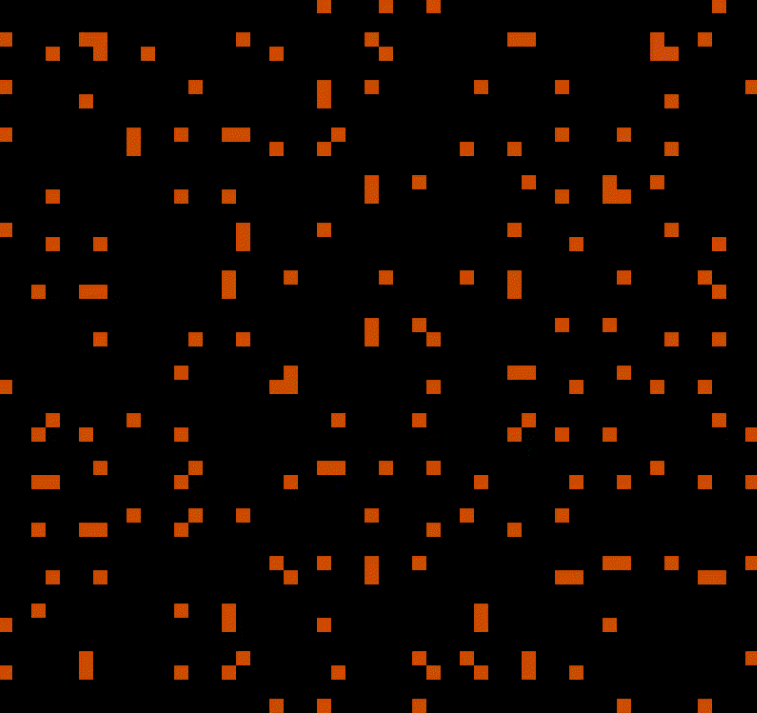
</figure>
