[..](../index.html)

# Room generation using edge extrusion

- [Simplified algorithm](#sim)
- [Generations](#res)
- [Tweaking parameters](#twe)

I was looking into generating apartment-like level layouts for a game prototype. Working with Python is easier to test the algorithm, hence this first implementation.

I came up with the rectangle based algorithm, but there is a high chance it already exists somewhere else.

## <a name="sim"></a>Simplified algorithm

This is a pseudo-code version of the algorithm I used. ``extrude(rectangle)`` is a function that chooses a random edge from ``rectangle``, and extrudes it in three directions: front and two sides.

``extrude(rectangle)`` can be called multiple times to generate multiple openings, hence the invalid edges list to prevent from extruding the same edge multiple times.

```
extrude (rectangle):
    edge = random edge from rectangle that is not an invalid edge
    add the edge to the rectangle's invalid edges
    
    make an opening in the chosen edge
    
    extrude edge in front
    if extruded edge hit a wall:
        add the edge to the rectangle's invalid edges
        
    if edge could extrude enough in front:
        extrude edge on the sides
        if extruded edges hit a wall:
            add the edge to the rectangle's invalid edges
            
        create new rectangle using the extruded edges
        extrude (new rectangle)
        
base rectangle = rectangle in the middle of the image
extrude (base rectangle)
```

Here is an example on a rectangle being extruded (the base rectangle is always the bottom one, and is not the same every time):

<figure style="display: inline-block; padding-right: 40px">
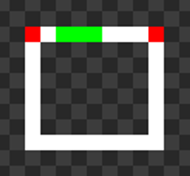
<figcaption>opening in green</figcaption>
</figure>
<figure style="display: inline-block; padding-right: 40px">
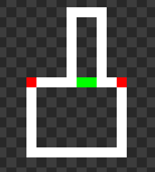
<figcaption>front extruding</figcaption>
</figure>
<figure style="display: inline-block; padding-right: 40px">
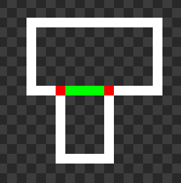
<figcaption>sides extruding</figcaption>
</figure>

<div class="sideside" markdown="1">
And here is an example of a rectangle being extruded multiple times (on the left, right and top). Though, for the first generations I only made it so a single edge could be extruded.
{: .tleft }
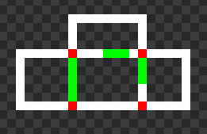
{: .imright }
</div>

## <a name="res"></a>Generations

In the beginning there were still problems with extruding edges not stopping when they hit a wall, which caused some overlapping. This is the first working version on a large image.

<figure style="display: inline-block">
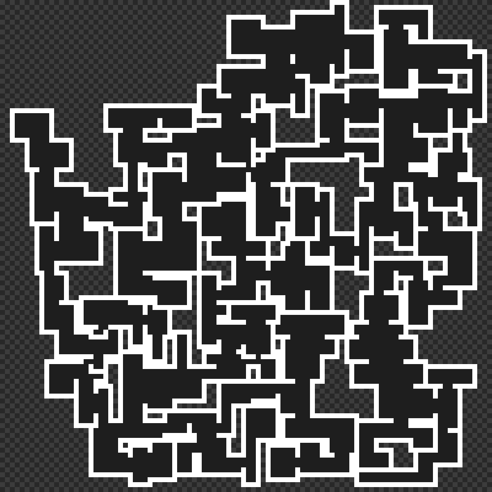
<figcaption>generated rooms</figcaption>
</figure>
<figure style="display: inline-block">
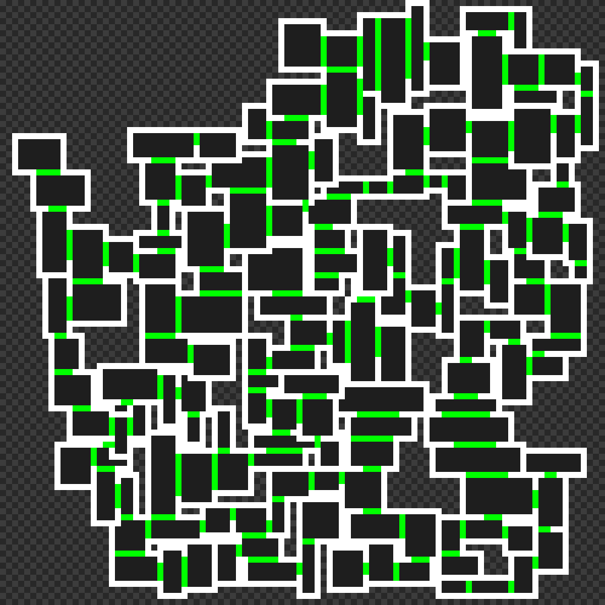
<figcaption>openings are marked in green</figcaption>
</figure>

The little artefacts generated by the overlapping bug make interesting shapes, but isn't very playable...

<figure style="display: inline-block">
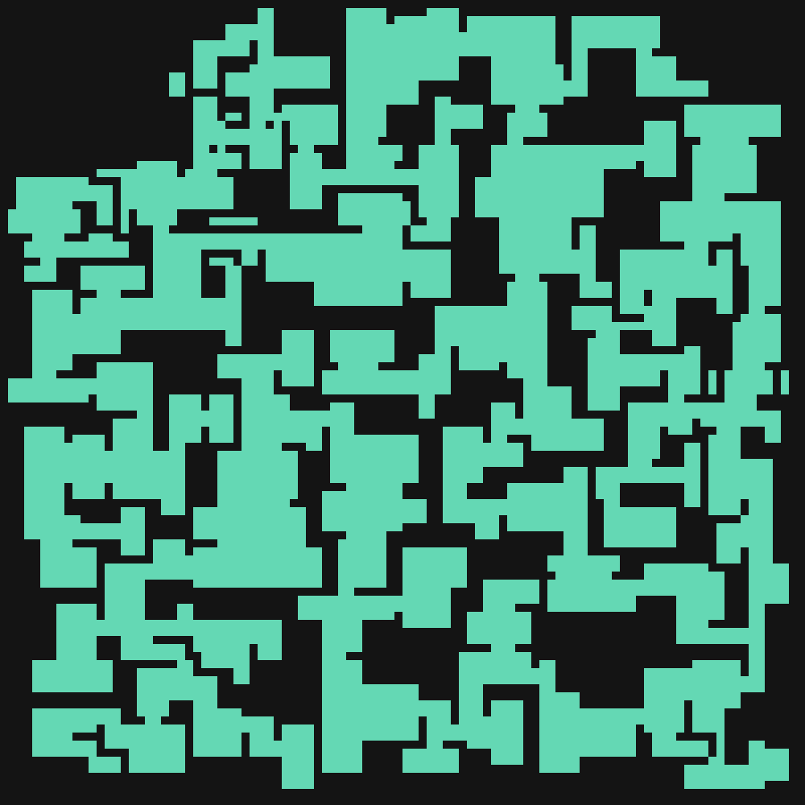
</figure>
<figure style="display: inline-block">
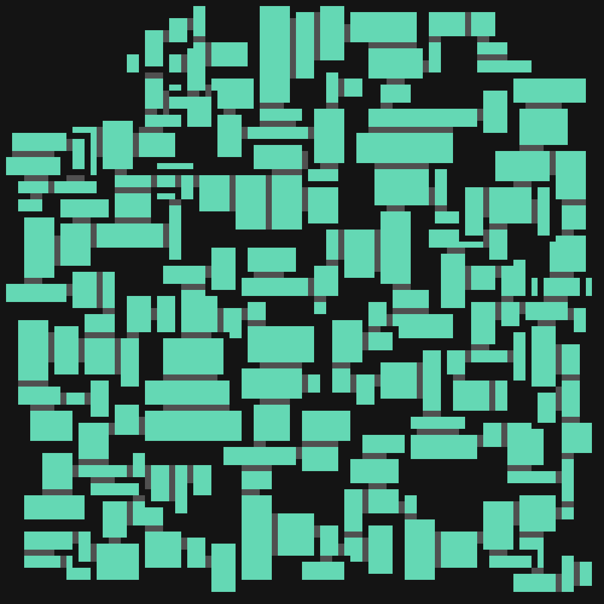
</figure>

I then tried to make smaller rooms. This one generated openings from multiple edges, and actually worked quite well compared to the previous ones.

<figure style="display: inline-block">
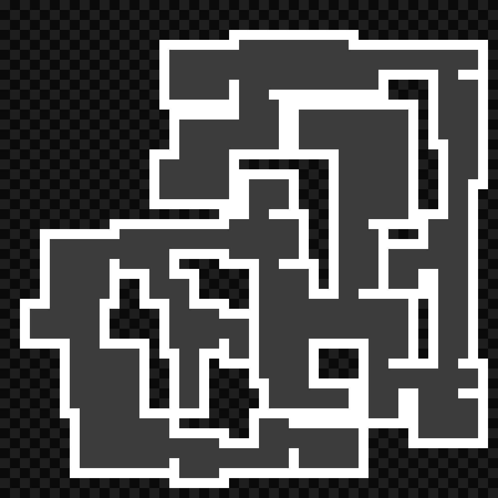
</figure>
<figure style="display: inline-block">
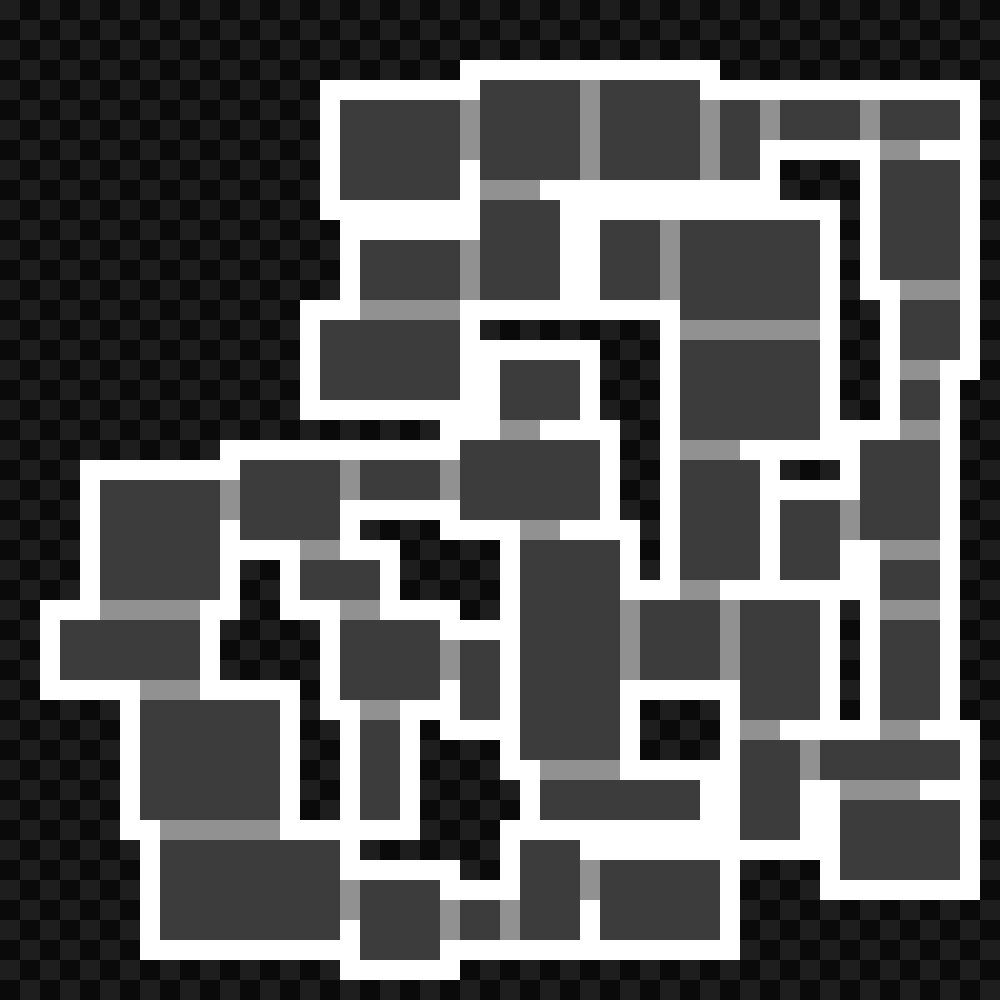
</figure>

<figure style="display: inline-block">
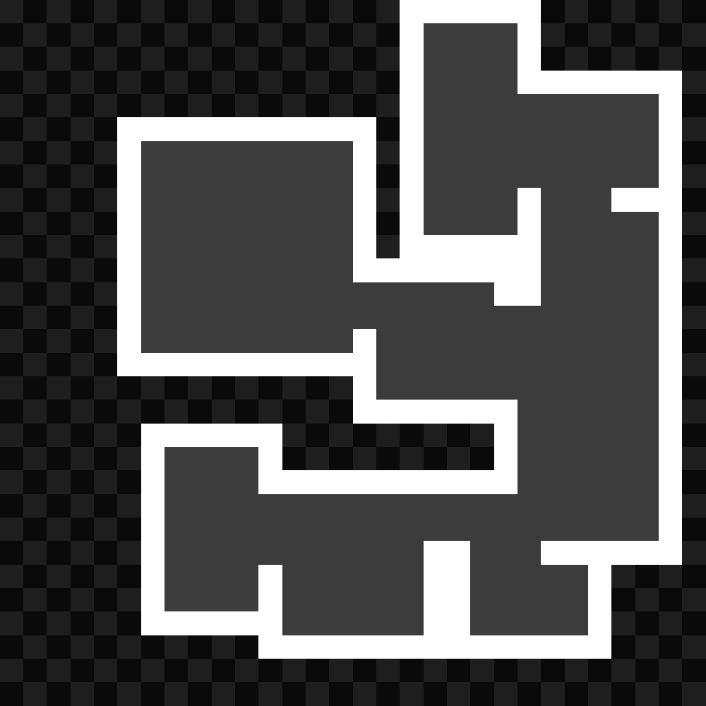
</figure>
<figure style="display: inline-block">

</figure>
<figure style="display: inline-block">

</figure>
<figure style="display: inline-block">

</figure>

These small ones could be used as floors

For visualization and debugging purposes, I made animations showing each step of the algorithm.
All GIFs were generated using ``FFMPEG``, using the same process which is detailed [in this post.](./2024-01-19-dungen.html)
Here are a few of them:

## <a name="twe"></a>Tweaking parameters

Changes were made:
Only extruding in front, not on the sides:

Making extruded lengths longer:

... And smaller:
