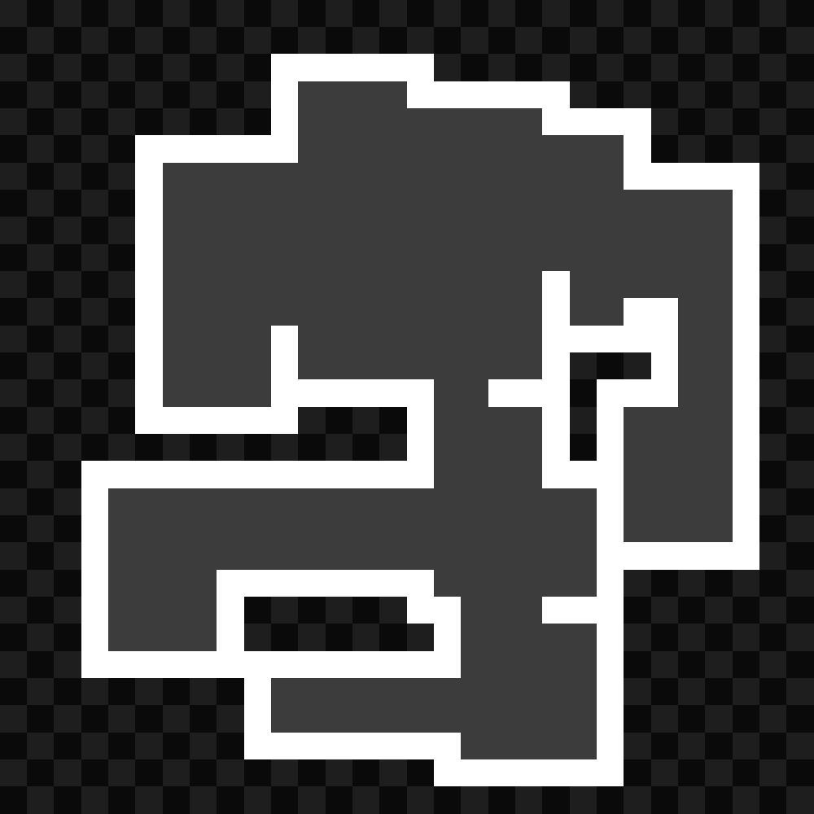
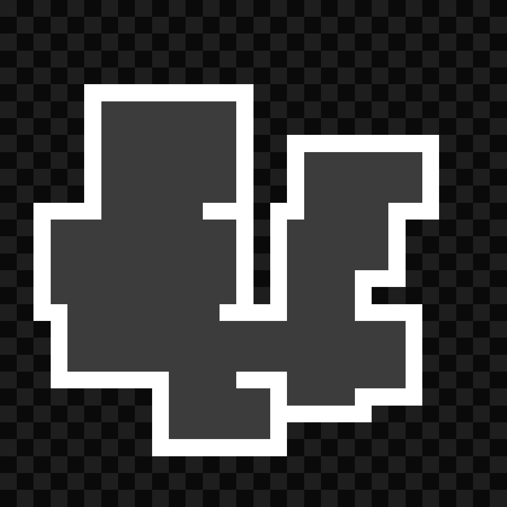
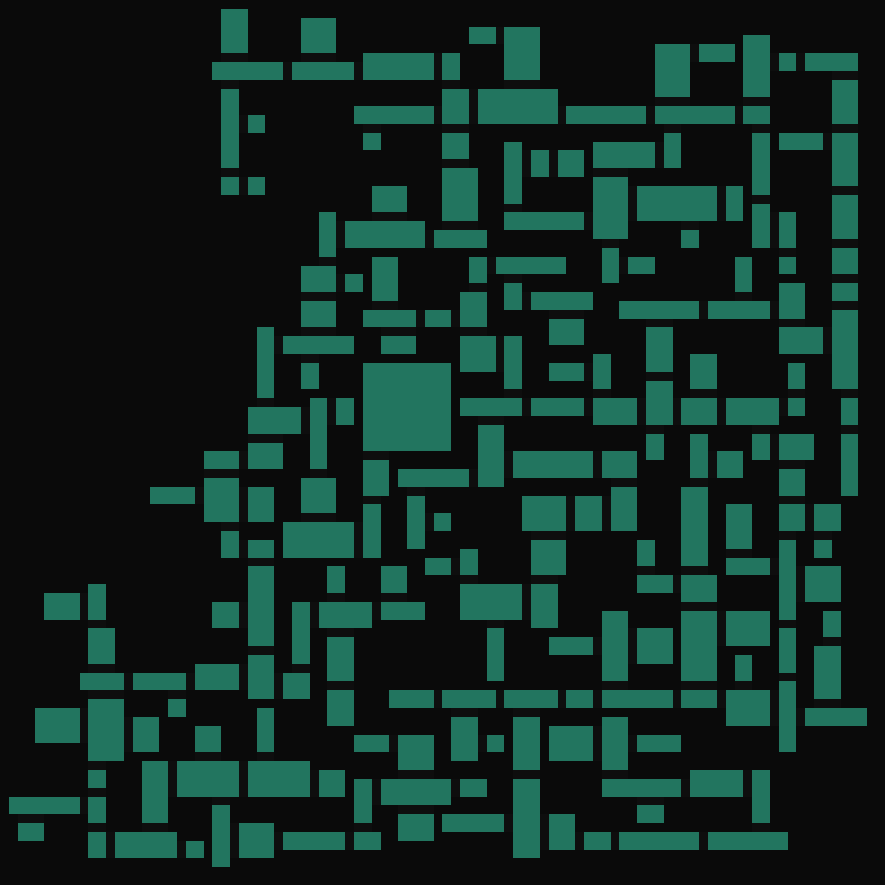

[..](../index.html)

# Room generation using edge extrusion

- [Simplified algorithm](#sim)
- [Generations](#res)
- [Tweaking parameters](#twe)
- [Wall tiles replacement](#tre)

I was looking into generating apartment-like level layouts for a game prototype. Working with Python is easier to test the algorithm, hence this first implementation.

I came up with the rectangle based algorithm, but there is a high chance it already exists somewhere else.

## <a name="sim"></a>Simplified algorithm

This is a pseudo-code version of the algorithm I used. ``extrude(rectangle)`` is a function that chooses a random edge from ``rectangle``, and extrudes it in three directions: front and two sides.

``extrude(rectangle)`` can be called multiple times to generate multiple openings, hence the invalid edges list to prevent from extruding the same edge multiple times.

```
extrude (rectangle):
    edge = random edge from rectangle that is not an invalid edge
    add the edge to the rectangle's invalid edges
    
    make an opening in the chosen edge
    
    extrude edge in front
    if extruded edge hit a wall:
        add the edge to the rectangle's invalid edges
        
    if edge could extrude enough in front:
        extrude edge on the sides
        if extruded edges hit a wall:
            add the edge to the rectangle's invalid edges
            
        create new rectangle using the extruded edges
        extrude (new rectangle)
        
base rectangle = rectangle in the middle of the image
extrude (base rectangle)
```

Here is an example on a rectangle being extruded (the base rectangle is always the bottom one, and is not the same every time):

<figure style="display: inline-block; padding-right: 40px">

<figcaption>opening in green</figcaption>
</figure>
<figure style="display: inline-block; padding-right: 40px">

<figcaption>front extruding</figcaption>
</figure>
<figure style="display: inline-block; padding-right: 40px">

<figcaption>sides extruding</figcaption>
</figure>

<div class="sideside" markdown="1">
And here is an example of a rectangle being extruded multiple times (on the left, right and top). Though, for the first generations I only made it so a single edge could be extruded.
{: .tleft }

{: .imright }
</div>

## <a name="res"></a>Generations

In the beginning there were still problems with extruding edges not stopping when they hit a wall, which caused some overlapping. This is the first working version on a large image.

<figure style="display: inline-block">

<figcaption>generated rooms</figcaption>
</figure>
<figure style="display: inline-block">

<figcaption>openings are marked in green</figcaption>
</figure>

The little artefacts generated by the overlapping bug make interesting shapes, but isn't very playable...

<figure style="display: inline-block">

</figure>
<figure style="display: inline-block">

</figure>

I then tried to make smaller rooms. This one generated openings from multiple edges, and actually worked quite well compared to the previous ones.

<figure style="display: inline-block">

</figure>
<figure style="display: inline-block">

</figure>

<figure style="display: inline-block">

</figure>
<figure style="display: inline-block">

</figure>
<figure style="display: inline-block">

</figure>

<figure style="display: inline-block; padding-right: 40px">

<figcaption>only walls</figcaption>
</figure>
<figure style="display: inline-block; padding-right: 40px">

<figcaption>separated rooms</figcaption>
</figure>

These small ones could be used as floors or levels, since their size is more manageable.

Here are two final results when the algorithm worked properly without any overlapping:

<figure style="display: inline-block">

</figure>
<figure style="display: inline-block">

</figure>

For visualization and debugging purposes, I made animations showing each step of the algorithm.
All GIFs were generated using ``FFMPEG``, using the same process which is detailed [in this post.](./2024-01-19-dungen.html)
Here are a few of them:

<figure style="display: inline-block">

</figure>
<figure style="display: inline-block">

</figure>

The size seems appropriate, but we'd have to put a player in there to see if it is large enough.

A limit to this kind of algorithm is that it can't generate "loops", as rectangles can't connect to already placed rectangles.

*Edit 04/06: We could get different results by using a list instead of a recursive function call to extrude the openings (by queueing each opening and extruding the first one in the list each iteration). This would make the rectangles extrude there and there instead of following the same "line".*

## <a name="twe"></a>Tweaking parameters

Making extruded lengths longer:

<figure style="display: inline-block">

</figure>
<figure style="display: inline-block">

</figure>

... And even longer:

<figure style="display: inline-block">

</figure>
<figure style="display: inline-block">

</figure>

Having the same opening size each time (2 pixels) and not extruding on the sides:

<figure style="display: inline-block">

</figure>
<figure style="display: inline-block">

</figure>

Making the size more random, resulting in lots of variations in room shape:

<figure style="display: inline-block">

</figure>
<figure style="display: inline-block">

</figure>

Two more that were very random too:

<figure style="display: inline-block">

</figure>
<figure style="display: inline-block">

</figure>

## <a name="tre"></a>Wall tiles replacement

For some visual upgrade, I replaced the huge white blocky walls with tiles.

I decided to use a dictionnary of images, with keys being the connections they have (in a `"lurd"` order, for "left, up, right, down"). This speeds up the tile replacing process as it knows directly where to look for the tile image.

`load_tiles(tiles)` loads every tile rotation into the `tiles` dictionnary. Then, whenever we encounter a pixel that is marked as a wall, `get_matching_tile(j, i, tiles)` is called and returns a corresponding tile image. The connections are always checked in the same order, so the dictionnary keys always match.

```python
def load_tiles(tiles):
    # load images
    cornerImg = Image.open("tiles/corner.png")
    crossImg = Image.open("tiles/cross.png")
    (...)
    
    # insert into dict
    tiles['lu'] = cornerImg;
    tiles['lud'] = threeImg;
    tiles['lrd'] = threeImg.rotate(180);
    tiles['lurd'] = crossImg;
    tiles['l'] = endImg;
    tiles['d'] = endImg.rotate(90);
    (...)
    
def get_matching_tile(j, i, tiles):
    c = ""
    
    # check we're not out of bounds
    if (i-1 >= 0) and grid[j,i-1] == 1:
        c += 'l'
    if (j-1 >= 0) and grid[j-1,i] == 1:
        c += 'u'
    if (i+1 < nb_tiles) and grid[j,i+1] == 1:
        c += 'r'
    if (j+1 < nb_tiles) and grid[j+1,i] == 1:
        c += 'd'
        
    return tiles[c]
```

Here are two results. The ladder artifact found with walls of 2 pixels wide is technically a bug... But I decided to keep it in to add style.

<figure style="display: inline-block">

</figure>
<figure style="display: inline-block">

</figure>

On smaller rooms it happens less frequently:

<figure style="display: inline-block;">

</figure>
<figure style="display: inline-block;">

</figure>
<figure style="display: inline-block;">

</figure>

Finally, just for fun I wanted to stress test the tile amount.

<figure style="display: inline-block">

</figure>

`250x250` tiles...

<figure style="display: inline-block">

</figure>

Here's a version with 500 tiles per row/column. It could not even render tiles, because they were too small.

<figure style="display: inline-block">

</figure>

It seems like it cannot go over 500 tiles. Even if it could, the tiles would have a float sized width and height, which is not useful for drawing pixels at integer positions on an image.

Now, "areas" could be added. Areas would be a different color and use different parameters (room size, opening size and shift...) to define different biomes and such.

*Update 29/10/24: I tried adding colored areas. These are very glitchy tests, but the idea is here.*

<figure style="display: inline-block">

</figure>
<figure style="display: inline-block">

</figure>

<figure style="display: inline-block">

<figcaption>adding a different color to each rectangle</figcaption>
</figure>