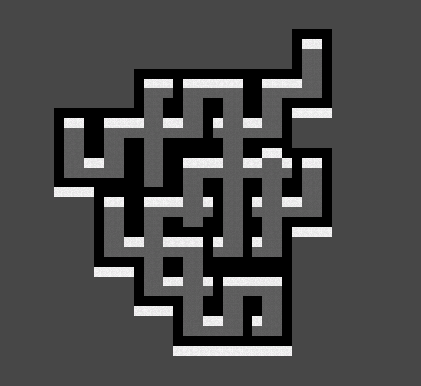

[..](../index.html)

# Room generation using edge extrusion

I was looking into generating apartment-like level layouts for a game prototype. Working with Python is easier to test the algorithm, hence this first implementation.

I came up with the algorithm, but there really is a chance it already exists somewhere else.

You can jump directly to the results if code doesn't interest you.

    test of things that are side by side

   

