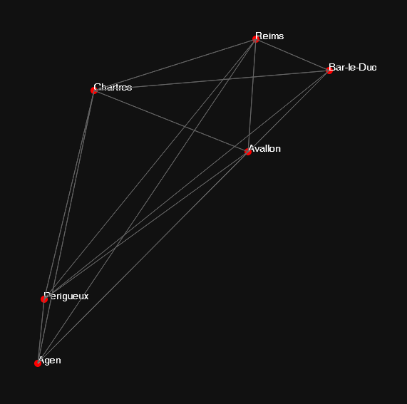
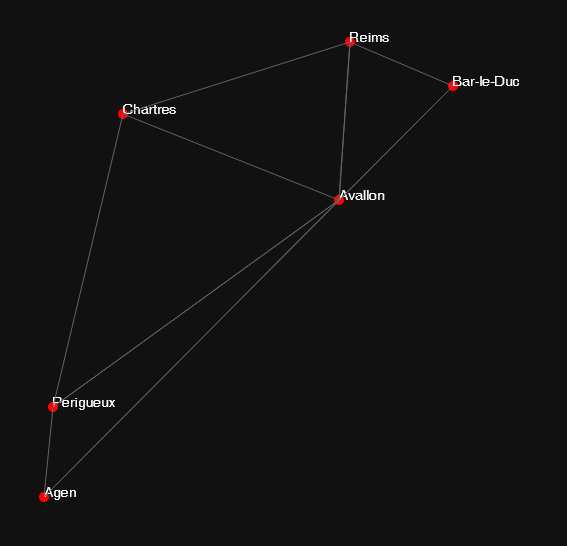

[..](../index.html)

# Most cities played in 24 hours

- [The problem](#1)
- [Laying out](#2)
- [SDL pixel perfect rendering](#3)
- [Results](#4)

How many cities can a band play in within only 24 hours?

This was inspired by the *Crywank* tour in which they played 16 shows in the UK, in only 24 hours.

Thinking about it, maybe there would have been a way to compute the maximum amount of cities playable at using graph theory. Yes, that is very nerdy. But let's find out.

# The problem

Suppose we have a set `S` of points representing cities.
Let `G = (S, A)` the oriented graph of every city interconnected. Let every edge `(a, b)` have a weight being the travel distance (in seconds) between city `a` and city `b`.

We are going to assume that the band travels in a car that can go at 50km/h on average. This way, we can easily calculate the travel distance between two cities by dividing their Euclidean distance (in km) by the speed of the car.

Let's assume every gig takes no more than 20 minutes. To that, let's add 5 minutes of setting-up and 5 minutes of getting everything back in the car. When it's over, the band immediately starts to travel to the next city.

We want to find a path of `n` vertices in `G` that verifies the following conditions:
1. the total weight is less than `(24*60*60) + n * (30*60)`, so `86400 + n * 1200` (time to travel + time to play the gigs)
2. it has the maximum possible amount of vertices

It resembles the traveling salesman problem and the longest path problem, but after some research these didn't help much...

# Laying out

Fortunately, a course held this semester focused on graph algorithmics. And by chance, a dataset of 6 to 112 points representing the cities of France was handed out during a practical exercise.

However, we still have to input the edges ourselves.

First of all, the graph clearly doesn't need to be complete: two cities that are very far from each other are not going to be interesting to obtain a small weight. To optimize, we could use real life road data between the cities.

As this is hard to find online, I chose to use a Delaunay triangulation instead.
I used `Numpy` and `Scipy` to triangulate the points.

<figure style="display: inline-block">
   
   <figcaption>complete graph</figcaption>
</figure>
<figure style="display: inline-block">
   
   <figcaption>delaunay</figcaption>
</figure>

On the entire map, we can see an interesting cluster of cities around Paris. Let's see how this turns out later...

Now, let's compute the weights. Fortunately, the dataset had realistic coordinates so the Euclidean distances matched when I computed them. Dividing the distance by a `carSpeed` variable gives us the travel time from one city to another.

img in distance, in hours, in seconds

# Solving the problem

Methods that couldn't have worked:
- brute-forcing the graph by examinating every possible path: impossible because of the $ \fact{n} $ possibilities
- constructing a 

**Initialization**
- pick a `start` vertex as a starting point for the path
- initialize `total_time` to 0
- initialize `visited` to an empty list (the list of visited cities)
- let `ends = (a, b)` a couple representing the two vertices on the two ends of the path: initialize it as `(start, start)`

**While `total_path_weight < maximum_total_weight`**
- check if adding 30 minutes to `total_time` still satisfies the condition
    - if so, add the time. If not, break the loop
- compare the weights of all the edges that come from `ends.a` or `ends.b`, except those leading to a vertex in `visited`. Then get the edge of form `(from, next)` with the minimal weight
- add `from` to `visited`
- check if adding the travel time from `from` to `next` to `total_time` still satisfies the condition
    - if so, add the time. If not, break the loop
- if `from == ends.a`, then `ends.a = from`. Same for `ends.b`
    
In the end, the number of cities visited is the length of the `visited` list, and `total_time` is the play time plus the travel time. Travel time and then play time are easily computable.

What's cool is that it barely takes `0.01` seconds to execute in Python with the 112 cities dataset.

## Picking a starting point

As you may have seen in the 112 cities dataset, there is quite a huge cluster of cities near Paris. Therefore, these vertices connect with edges of very small weights. Which would make a great starting point, as multiple cities could quickly be covered.

I used this idea to make a first `findLowestSumVertex()` function that calculates the sum of the weights of the edges for every vertex, and then returns the vertex with the lowest sum.

This function should return a point that is very close from other points, hence its lowest sum of edge weights. Now here's an example of why that couldn't work...(big cluster and super far from others)

The second method was to run the algorithm `n` times and make it return the number of visited cities. By testing every vertex as a starting point, it ensures that there is no omitted path. Then, we could just take the vertex that maximizes the output of the algorithm when used as a starting point.

# Results

When running the full algorithm on the 112 cities dataset we get this:

# Solving the problem

(depth first)
The first idea was to brute-force the graph by examinating every possible path. Then, we pick the maximum number of vertices in a long path and return the list of paths.

Let's start by constructing a hamiltonian path, i.e. a cycle that visits each vertex once. For `n` vertices, there would be `n` edges in this path.

Now let's remove a random edge from the cycle: we have `n` possibilities to choose from.
This will create a "breach" in the path. As to not break the path into two distinct paths, we shall choose to remove one of the two edges that would not break the path.
Which gives us two more choices.

If we stop the process when the total weight is under the threshold, then at most $$ \binom{n}{1}\times\underbrace{\binom{2}{1}\times\cdots\times\binom{2}{1}}_\text{$n-2$ times}\times1 $$ paths are tested for $n$ vertices. Or simplified: $ n\times2^{n-2}\times1 $.
NOT SURE
For 

## Finding the best start

least sum

then pick the one in extremities that is the best
NOT THE BEST VERSION TO USE LEAST SUM: SHOW WHY EXAMPLE

run algorithm with every point and compare the weights

no proof that it's the best

2.
TEST WITH EVERY POINT?
add active vertex to list
get least heavye edge (to one that is not already visited) and add the new vertex

1.
get hamiltonian path (FIND THE BEST ONE?)
remove random/heaviest edge
remove heaviest of the two edges until threshold is satisfied

GET CLOSEST POINT FIRST:
point with the least sum of weights around it

ok utiliser map?
existe déjà solution problème?
triangulation impacte algorithmes vus en cours ou pas?

faire traveling salesman sur tout
retirer chaque point individuellement (combinaison)

MINIMUM HAMILTONIAN PATH?????
réduction chaîne hamiltonienne ENLEVER LE PLUS GRAND QUI NE COUPE RIEN (ou random) (ou analyser tout) À CHAQUE FOIS

clustering en fonction de la distance?

d'abord Dijkstra pour plus petits chemins pour tout le monde
puis exploration de chaque sommet vers chaque sommet

start with max subgraph or min subgraph
add continuously (closest...)

testing on two separated clusters
extract from google maps or open street map