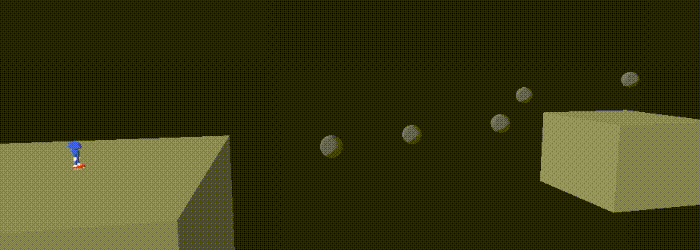

[..](../index.html)

# Sonic's rail grinding mechanic in Unity

- [Bézier curves](#1)
- [Generating the mesh](#2)
- [Gameplay](#3)
- [More physics](#4)

I wanted to try and recreate the rail grinding game mechanic from the Sonic series.

In the main games, every rail seems to be an individual asset created in another program.

Here, I'd like to make a procedural system that fits in Unity, is simple and fast to use. This way, rails could be prototyped and tested easily.

For some of the functions logic, I took inspiration from [this Catlike Coding tutorial](https://catlikecoding.com/unity/tutorials/curves-and-splines/) on splines.

# <a name="1"></a>Bézier curves

<div class="sideside" markdown="1">
I decided to use cubic Bézier curves. These curves have 4 control points $$P_i$$. The curve starts at $$P_0$$ and ends at $$P_3$$. The problem is, as you can see the curve doesn't go through each of the 4 points (interpolation property).
{: .tleft }

{: .imright }
</div>

Instead, we can use Bézier interpolation.

We have a set of $$n$$ points.
The idea is to create $$n-1$$ cubic Bézier curves in total, one between each point.

To fit each curve, we want to find the position of the two control points $$P_1$$ and $$P_2$$ in between the two points $$P_0$$ and $$P_3$$ we are trying to connect.

I'm not going to go into the math details, because [this Medium article by Omar Aflak](https://omaraflak.medium.com/b%C3%A9zier-interpolation-8033e9a262c2) already explains it very well.

But in the end, we have a matrix of the form $$Ax = B$$ to solve. Unity doesn't have a built-in linear algebra library, so I installed [Math.NET Numerics](https://numerics.mathdotnet.com/) using the [NuGet for Unity package manager](https://github.com/GlitchEnzo/NuGetForUnity/).

<figure style="display: inline-block">

<figcaption>control points are shown in red and green</figcaption>
</figure>

Now I can just add another point wherever I want in the hierarchy and the curve is computed just fine. This allows for easy tweaking.

<figure style="display: inline-block">

</figure>

*Note: The only little problem is that it doesn't have local control. This means that changing a small portion of a curve can change the entire curve.*

<!--Of course, using a Bézier curve with configurable control points would have given us more control over its shape.-->

Then, I made a `Vector3 GetPoint(float t)` function (with `t` between 0 and 1) that returns a point of the curve. With a `N` variable that defines the number of points, we can start sampling the curve. Points are drawn in the `OnDrawGizmos()` function using `Gizmos.DrawSphere(position, radius)`.

<figure style="display: inline-block">

<figcaption>N = 50</figcaption>
</figure>

<figure style="display: inline-block">

<figcaption>N = 200</figcaption>
</figure>


# <a name="2"></a>Generating the mesh

Before computing the mesh, we still need two more functions to retrieve vectors for each point:

- <span color="yellow">The direction (or forward) vector.</span> We can get it using the first derivative $$f’(t)$$ of the Bézier curve equation.
- <span color="red">The up vector.</span> This will indicate on which side to position the player, and also the upper side of the rail.

*I'm sure there could be a way to calculate the up vector it using the direction vector (something perpendicular, for say). But to allow for more control, up vectors will be set manually by rotating the arrows.*

<figure style="display: inline-block">

<figcaption>forward and up vectors are visualized</figcaption>
</figure>

With that done, let's get into the mesh generation. I added a **Mesh Filter** and a **Mesh Renderer** component to the rail object.

<!-- All we have to do is build faces between each sampled point. -->

For each point of the curve, we obtain its $$\vec{forward}$$, $$\vec{up}$$ and $$\vec{right}$$ vectors (remember we can get the $$\vec{right}$$ vector as $$\vec{forward} \wedge \vec{up}$$). Using these vectors and the sampled point position, we add 4 new vertices to the mesh. Then, using the 4 vertices of the point that was sampled one step before, we construct 8 triangles.

<figure style="display: inline-block">

</figure>
<figure style="display: inline-block">

</figure>

<figure style="display: inline-block">

</figure>

And here are some rail meshes! I also added a `radius` variable to control their width.

Using submeshes and a different material, I made the upper face a different color to help visualize the up vector more clearly:

<figure style="display: inline-block">

</figure>

Here's a very stripped down version of the function used to create the mesh:

```cs
void GenerateMesh() {

    List<Vector3> verts = new List<Vector3>();
    
    List<int> triangles = new List<int>();
    List<int> upTriangles = new List<int>();      // vertices of the upper face

    Mesh mesh = new Mesh { name = "railMesh" };

    for (int i = 0; i < N; i++) {

        [add vertices and triangles...]
    }

    mesh.subMeshCount = 2;

    mesh.vertices = verts.ToArray();
    
    // this allows for assigning different materials
    mesh.SetTriangles(triangles.ToArray(), 0);
    mesh.SetTriangles(upTriangles.ToArray(), 1);

    GetComponent<MeshFilter>().mesh = mesh;
}
```

# <a name="3"></a>Gameplay

I modeled possibly the worst ripoff model ever made, gave it some animations and a simple movement script.

To make griding rails easier, I want to implement the *homing attack* mechanic first.

Basically, when a target is close, the player can jump towards it to destroy it.

<div class="sideside" markdown="1">
I implemented it using a trigger collider. When a valid target enters the collider, it is added to a `potentialTarget` list. When it leaves, it is removed from the list. A script is constantly looking for the closest target in the list, and defines it as the actual target. When the player jumps again when a target is available (and close enough), it rushes towards it until it touches it, and destroys the target. If the target is a rail, the player gets on the rail.
{: .tleft }

{: .imright }
</div>

<figure style="display: inline-block">

</figure>

This will make it easier to start from the beginning of a rail instead of having to land exactly on it.

## Rail grinding

Once the player is on a rail, we just have to sample the curve at a `railProgress` variable (between 0 and 1) and add the up vector to get the player's position.

Speed also needs to be relative to the curve length (since we are always between 0 and 1, but the curve length is not). I approximated the curve length by summing the distances between each point (which means the accuracy increases as `N` increases). At each step, the player moves along the curve by `railSpeed / rail.curveLength * Time.deltaTime`.

The player is rotated according to the up vector with `Quaternion.LookRotation()`. The velocity force is also added at the end of the rail. Here's how it looks:

<figure style="display: inline-block">

<figcaption>grinding a loop</figcaption>
</figure>

If we want to jump directly on a rail, it is also possible. I simply added a **Mesh Collider** and a **Rigidbody** to the rail and made it detect player collisions. On collision, a function `GetClosestPointInCurve(Vector3 point)` returns the `t` (between 0 and 1) of the closest point on the curve to the collision point. The player's `railProgress` is then set to this value.

I made it so the camera follows the player when grinding. Here's a huge action scene with everything:

<figure style="display: inline-block">

</figure>


# <a name="4"></a>More physics

Right now, the rails act like they do in the modern games: the speed is constant.

So before I stop working on this forever, I'd like to add the *Adventure* games physics, where speed on a rail is controlled by many factors:

- the rail orientation: if the rail goes down, speed is increased. But if it goes up, you might fall behind if you don't have enough speed.

<figure style="display: inline-block">

<figcaption>not enough speed: the player goes backwards</figcaption>
</figure>

- crouching: by pressing a button on a rail that is going down, the player can gain momentum and thus, speed.

Of course, the rails in the actual games are far more polished and work way better than this demo, but it was an interesting experiment.


crouching
rail boosters


Turns out we need to generate the entire curve to be able to sample from it after.

Here's how it looks with linear interpolation:


# References

Medium article by Omar Aflak I used for fitting the curve: https://omaraflak.medium.com/b%C3%A9zier-interpolation-8033e9a262c2

Also a very good tutorial for Unity splines by Catlike Coding: https://catlikecoding.com/unity/tutorials/curves-and-splines/

Video by [This video (at 2:34)](https://youtu.be/JwN43QAlF50?si=1U9rBgv3T5iWEish&t=154) on the differences between each type of curve pretty well.

godot path 3D

https://www.youtube.com/watch?v=JwN43QAlF50 2:46
https://lucidar.me/fr/mathematics/catmull-rom-splines/