[..](../index.html)

# Planet generation with OpenGL

- [Generating the sphere mesh](#1)
- [Applying noise](#2)
- [Tweaking and adding color](#3)
- [Adding clouds](#4)

A little project I made to deepen my understanding of OpenGL and shaders. It was written in C++.

## <a name="1"></a>Generating the sphere mesh

I based my functions on [this very detailled article by Peter Winslow](https://peter-winslow.medium.com/creating-procedural-planets-in-unity-part-1-df83ecb12e91). You can check it out if you want more details and explanations on the mesh generation process.

Basically, we first have to generate an ico-sphere mesh (20 triangles) and then subdivide it `n` times. Subdivision divides each triangle into 4 smaller triangles.

So the code kind of looks like this (I created a `Planet` class to store everything):

```c++
Planet planet = Planet();     // make an empty planet
planet.InitAsIcosahedron();   // initialize the base mesh
planet.Subdivide(2);          // subdivide 2 times
```

<figure style="display: inline-block">
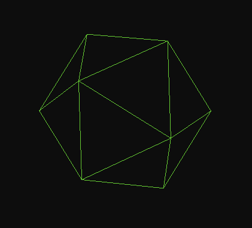
<figcaption>icosahedron mesh (n = 0)</figcaption>
</figure>
<figure style="display: inline-block">
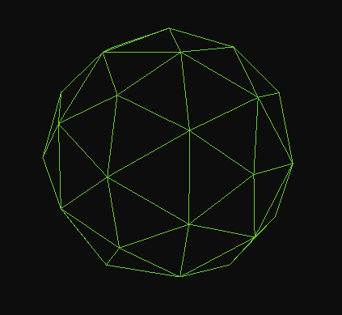
<figcaption>subdivided once (n = 1)</figcaption>
</figure>
<figure style="display: inline-block">
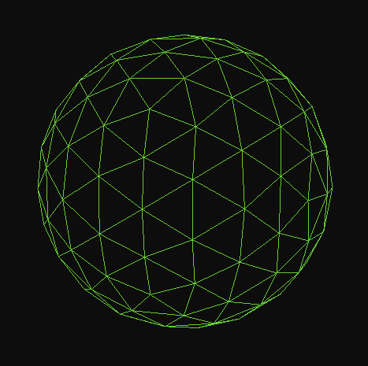
<figcaption>subdivided twice (n = 2)</figcaption>
</figure>

*Images are generated with these settings (face culling and polygon mode set to lines):*

```c++
glEnable(GL_CULL_FACE);
glCullFace(GL_BACK);       // doesn't render back faces

glPolygonMode(GL_FRONT_AND_BACK, GL_LINE);
```

As you can see, we get a rounder and rounder shape with each subdivision.

Unfortunately, the subdivision algorithm is exponentially slower as `n` grows, making it impossible to generate a mesh at runtime with `n >= 7`.

So I chose to make a subdivided ico-sphere in Blender, export it as an `.obj` file and load it in my program with a new `Planet.InitAsModel(char *path)` function. It uses the [Assimp](https://github.com/assimp/assimp) library to load the mesh.

<figure style="display: inline-block">
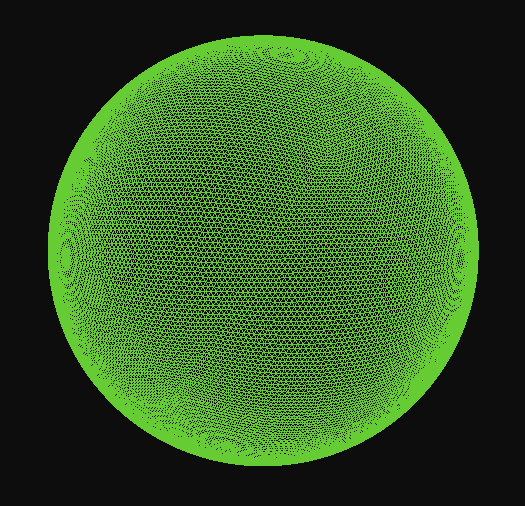
<figcaption>ico-sphere subdivided 7 times (less than 5 seconds of load time)</figcaption>
</figure>

*Note: a spherified cube mesh could have also worked.*

## <a name="2"></a>Applying noise

Since mapping a 2D-noise function over a sphere would be complicated, the idea is to sample a 3D-noise function for each vertex.

We are doing this in the vertex shader. I used [this 3D simplex noise shader's](https://www.shadertoy.com/view/XsX3zB) functions.

To apply elevation to the sphere, I first sample the noise value with the vertex's position vector. Then, since in a sphere a vertex's position vector is also its normal vector, I add the vector multiplied by the sampled value.

Here's a simplification of the shader:

```fs
#version 330 core
layout (location = 0) in vec3 aPos;

uniform mat4 model;
uniform mat4 view;
uniform mat4 projection;

void main()
{
    vec3 samplePos = aPos + vec3(1.0);
    
    /* noise parameters are omitted here but used */
    float value = perlinNoise(samplePos * scale);

    vec3 pos = aPos + (aPos * value);

    gl_Position = projection * view * model * vec4(pos, 1.0);
}
```

Elevation is applied well, but it needs some tweaking before it actually represents nice planet terrain. A first thing we can do is define a `seaLevel` threshold variable: this will make the terrain flat if the noise value is under the threshold.

<figure style="display: inline-block">
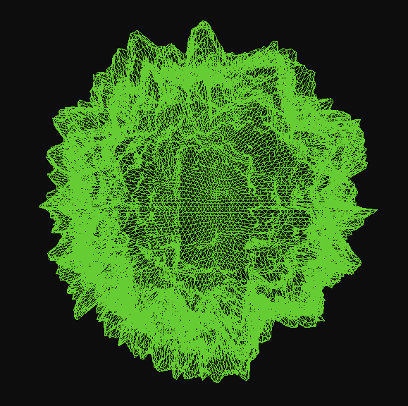
<figcaption>only noise elevation</figcaption>
</figure>
<figure style="display: inline-block">
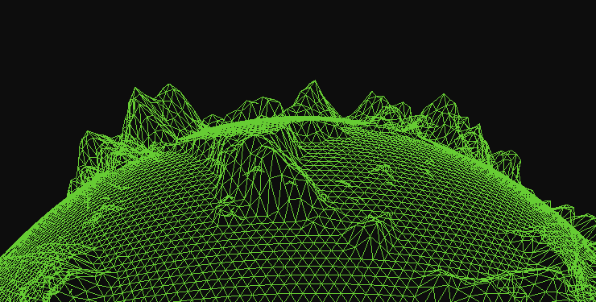
<figcaption>using a sea level threshold</figcaption>
</figure>

Also note that some vertices have negative coordinates, since the center of the sphere is `(0.0, 0.0, 0.0)`. This resulted in weird cut-offs around the sphere when the scale was small (left screenshot). I fixed this by adding `vec3(1.0)` to the sample position.

<figure style="display: inline-block">
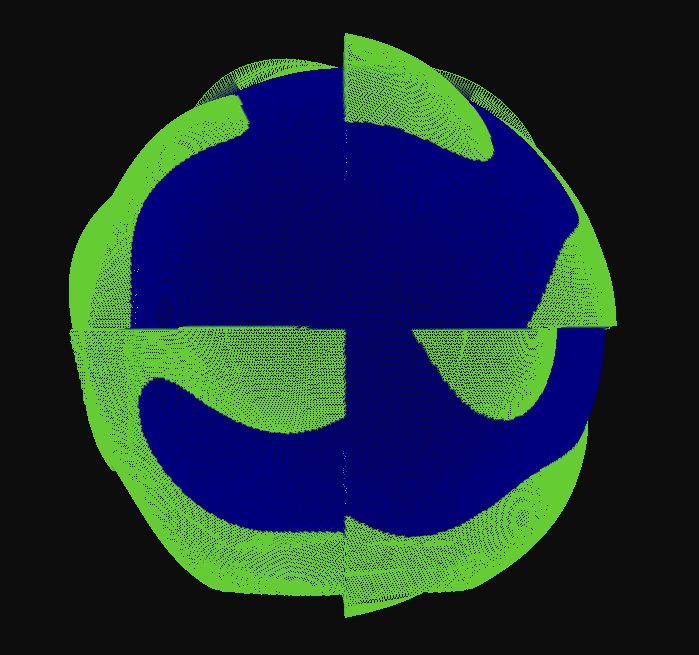
<figcaption>weird cutoff</figcaption>
</figure>
<figure style="display: inline-block">
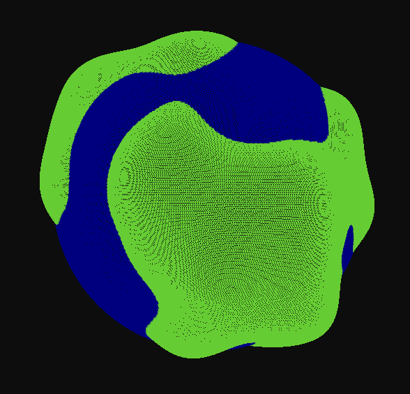
<figcaption>uniform shapes (also added coloration for the sea)</figcaption>
</figure>

## <a name="3"></a>Tweaking and adding color

<!--(and textures?)-->

Now I'm going to use [ImGui](https://github.com/ocornut/imgui) to make a menu for tweaking noise values. These will be variables sent to the vertex shader as uniforms, which will make editing the planet's shape faster.

I tweaked the noise parameters a bit, and colored vertices based on their elevation value:

<figure style="display: inline-block">
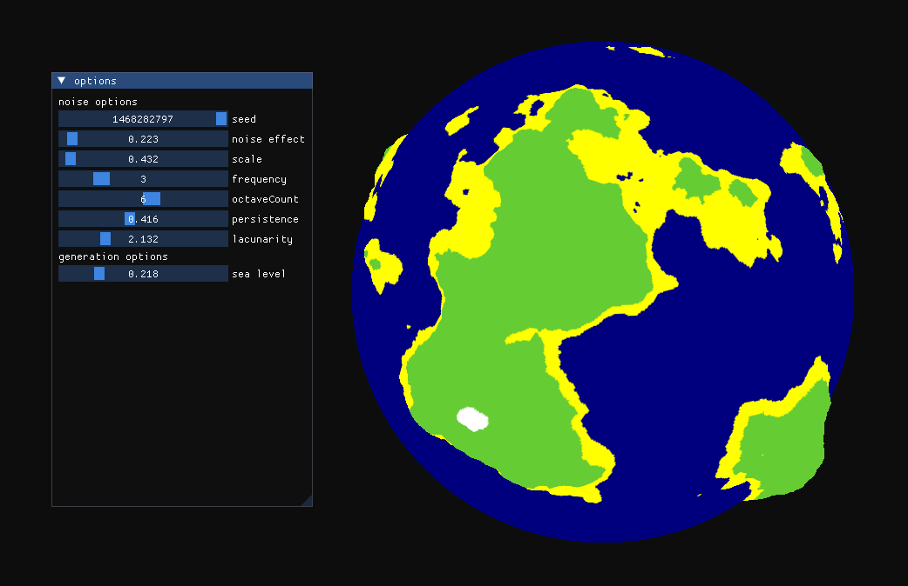
<figcaption>ocean, sand, grass and snow for the mountain peaks</figcaption>
</figure>

There's a very good [video about *Minecraft*'s procedural generation](https://youtu.be/CSa5O6knuwI?si=_PqqnXMuIIkOOERt&t=1482) in which we can learn that they use multiple noises (instead of only one) for the game's biome distribution:

<figure style="display: inline-block">
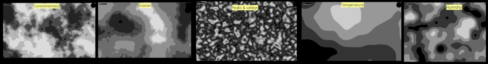
<figcaption>screenshot taken from the forementioned video at 24:42</figcaption>
</figure>

Then, depending on the sampled values, they use a look up table to tell which biome to generate.

Since their system is very complex, I'm only going to replicate the **temperature** and **humidity** noises, and use a bit of elevation information.

I added rules depending on the elevation (sea level, beach level, land level and peak level). If the elevation value is at land level, this is how the biome is selected (humidity from left to right and temperature from down to up):

<table class="ownTable">
  <tr>
    <td>Desert</td>
    <td>Savanna</td>
    <td>Jungle</td>
  </tr>
  <tr>
    <td>Plains</td>
    <td>Forest</td>
    <td>Dark forest</td>
  </tr>
  <tr>
    <td>Ice floe</td>
    <td>Snow plains</td>
    <td>Snow forest</td>
  </tr>
</table>

<figure style="display: inline-block">
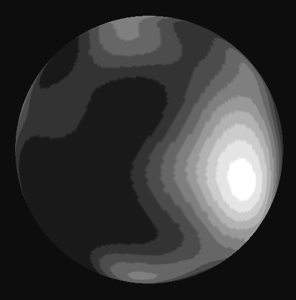
<figcaption>temperature</figcaption>
</figure>
<figure style="display: inline-block">
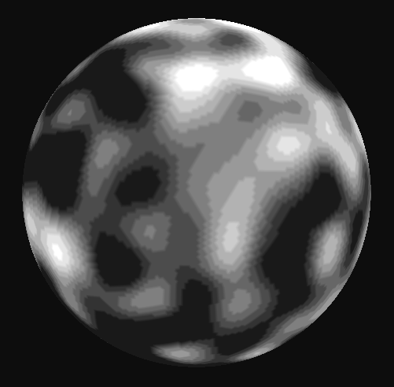
<figcaption>humidity</figcaption>
</figure>
<figure style="display: inline-block">
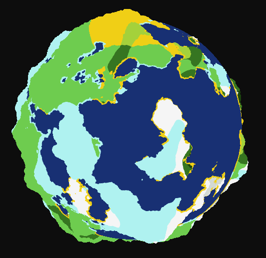
<figcaption>planet biomes</figcaption>
</figure>

Let's add a little effect to show elevation more:

<figure style="display: inline-block">
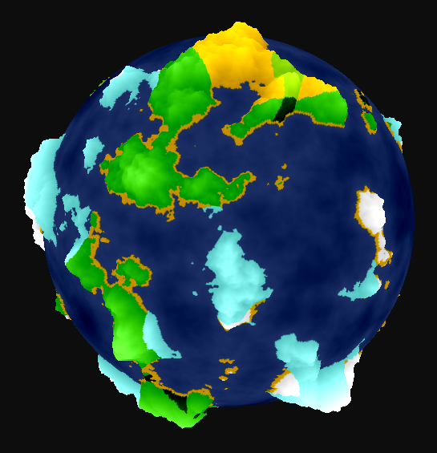
</figure>

And here we go! Here's the planet.

<figure style="display: inline-block">
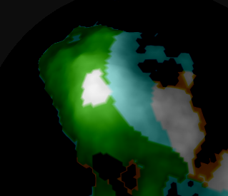
<figcaption>snow peaks</figcaption>
</figure>
<figure style="display: inline-block">
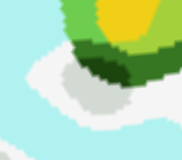
<figcaption>smooth transition between cold and humid forests</figcaption>
</figure>

One small drawback is that sampling two more noises significantly drops the FPS when using a lot of vertices.

## <a name="4"></a>Adding clouds

Then I decided to add clouds. I used the same planet sphere mesh and scaled it up a little. Then, I used a second noise to draw a greyish color if the sampled value is between two `cloud_min` and `cloud_max` thresholds.

<figure style="display: inline-block">
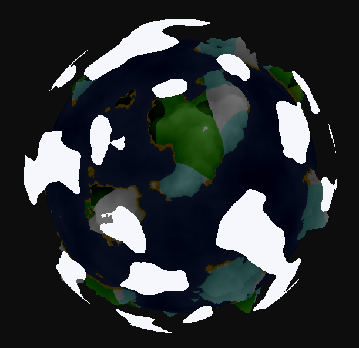
<figcaption>cloud_min = 0.28 and cloud_max = 1.0 work well</figcaption>
</figure>

Using a `time` uniform, I made the clouds move by adding `vec3(time * cloud_speed)` to the noise sample position.

Doing all of this in the fragment shader obviously costs more than doing it in the vertex shader but it's ok.