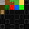
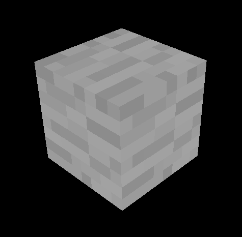
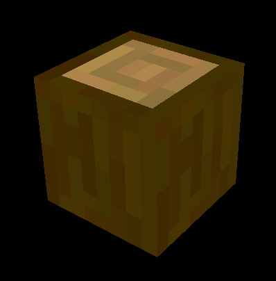
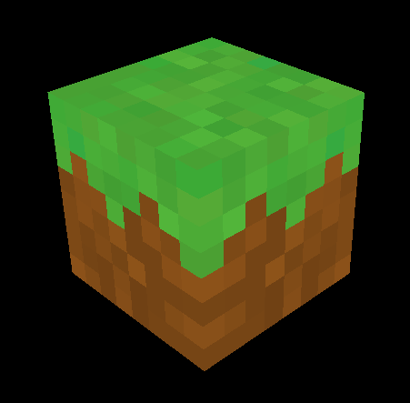
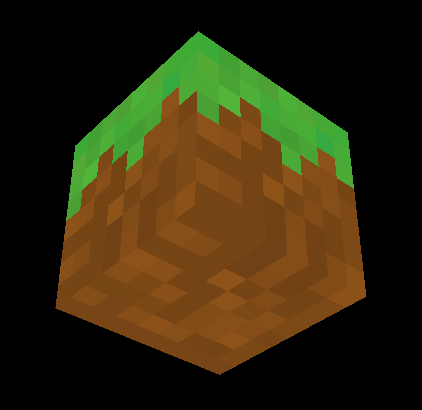
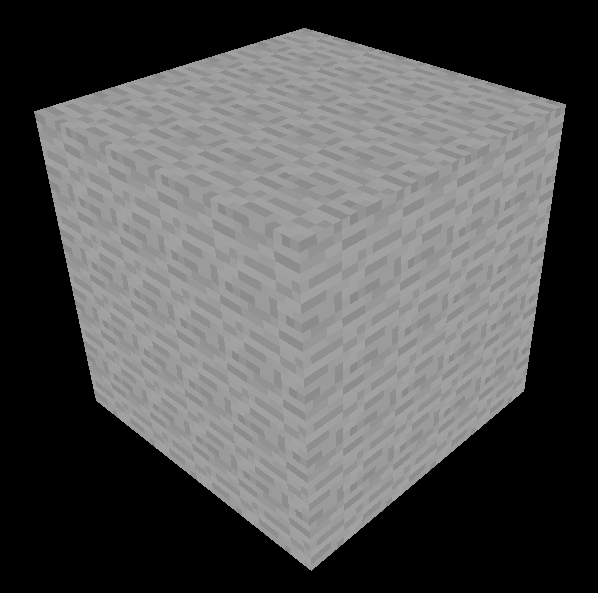
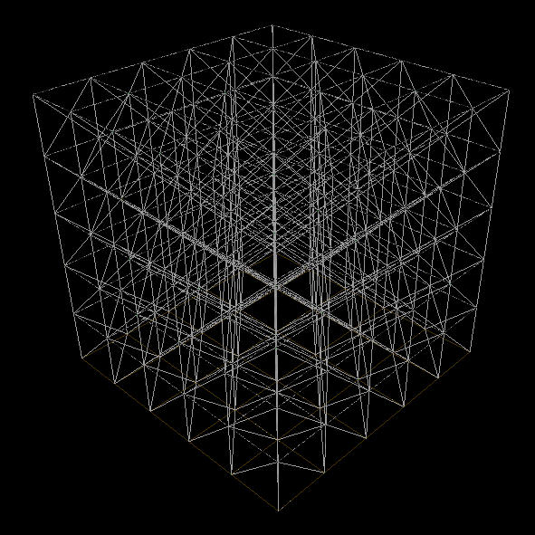
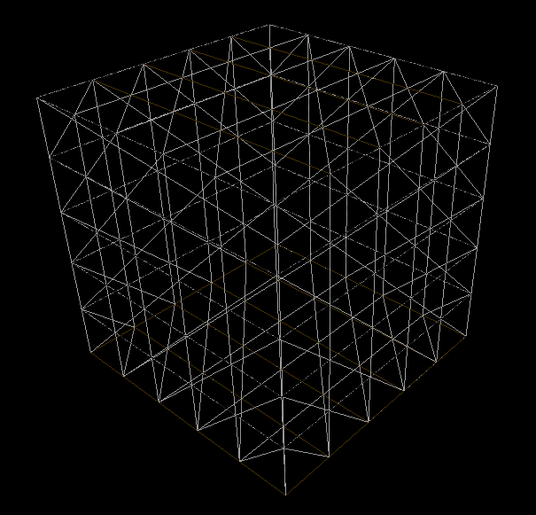
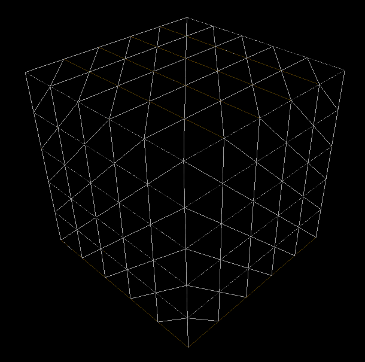

[..](../index.html)

https://youtu.be/ebeRZVHslO0?si=uE_04MIgKDC6BiLW&t=276
https://github.com/meemknight/minecraftGl/ source code

AMBIENT OCCLUSION HERE https://youtu.be/Ab8TOSFfNp4?si=9BFFB7KtQ7bAEs1s&t=2044

fps optimization techniques

in C++ with OpenGL.

I was highly inspired by [jdh's video](https://www.youtube.com/watch?v=4O0_-1NaWnY) and [Low Level Game Dev's series](https://www.youtube.com/watch?v=KK-s0FZ-2oY&list=PLKUl_fMWLdH-0H-tz0S144g5xXliHOIxC) on the subject (as well as the source code of their projects). The [Let's Make A Voxel Engine](https://sites.google.com/site/letsmakeavoxelengine/) was also interesting.
I'm going to re-explain some concepts here, but check out their videos for more detail.

# Rendering blocks

<!-- I also added the [camera.h] and [shader.h] files from [LearnOpenGL] since they provide basic functions. -->

First, let's render blocks to the screen.

We only have to store a block's position and type. So we're going to define it as a number to define its type. For the position, it will be easy to retrieve since blocks are going to be stored in chunks (more on that later).

*But if we had to store lots of informations in a block (flags, etc), then a `Block` class would have been necessary.*

```cpp
using Block = unsigned char; // 256 possible blocks

enum BlockType {
	STONE, DIRT, SAND, (...)
};
```

and since every block is later going to be stored in a chunk, we can get its position

For texturing, I'm going to use a single image called a texture atlas. Here's the one I made:

<figure style="display: inline-block">

<figcaption>8x8 texture atlas</figcaption>
</figure>

I used [`stb_image.h`](https://github.com/nothings/stb/blob/master/stb_image.h) to load the texture atlas.

```cpp
// defines an offset in the texture atlas
struct BlockFace {
	int x;
	int y;
};

// now define offsets for each texture in the atlas
BlockFace stone = { 0, 0 };
BlockFace dirt = { 1, 0 };
BlockFace grass = { 2, 0 };
(...)

// define which texture goes on which face for each block
// order: back, front, left, right, bottom, top
BlockFace faceTexture[][6]{
	{ stone, stone, stone, stone, stone, stone },    // STONE
	{ dirt, dirt, dirt, dirt, dirt, dirt },	         // DIRT
	{ dirt, dirt, dirt, dirt, dirt, grass },	 // GRASS
	(...)
};
```

This makes it easy to add a new block: add a value in the `BlockType` enum, define more `BlockFace` texture coordinates (if needed) and add a new element to `faceTexture`.

I'm sending the cube UVs `TexCoord` (between 0 and 1) and the texture offset `TexOffset` to the vertex shader. To sample the right texture using an offset, I use `TexCoord = (TexCoord + texOffset) / n_textures`, with `n_textures` being the number of textures in a line/column in the atlas.

(Because we want to stay in texture coordinate space)

<figure style="display: inline-block">

</figure>
<figure style="display: inline-block">

</figure>
<figure style="display: inline-block">

</figure>
<figure style="display: inline-block">

</figure>
<!--
<figure style="display: inline-block">

</figure>-->


block texture atlas (explain how to select texture)
    formula for selecting texture
    i have the basic bloc vertex data + uv
    i have a blockface struct (x and y) to define an offset in the atlas
    then i define blockfaces for each block in the texture atlas
    and then construct a faces array of blockfaces (indicable by BLOCK_TYPE) with the corresponding faces
first render a single block (6 faces) for the demo but now everything will happen inside a chunk

// (easily indiceable by a BlockType to fetch the right textures)

## Chunks

The world is going to be divided in chunks of `16 * 256 * 16` blocks.

<!-- The `Chunk` class stores blocks in a `Block blockData[CHUNK_SIZE][HEIGHT_LIMIT][CHUNK_SIZE]` 3D array. -->

Now let's say we want to render a completely filled chunk (65536 blocks). 65536 draw calls for each block is going to be **very** expensive performance-wise.

This is why I used a method called "baking" the chunk before rendering it: this means constructing a single mesh for the chunk, making it cost only one draw call to render.

We just have to iterate over each block, and if it's not `BlockType::AIR`, we add its 6 faces to the mesh.

<figure style="display: inline-block">

<figcaption>5x5 cube</figcaption>
</figure>
<figure style="display: inline-block">

<figcaption>wireframe render (4500 triangles)</figcaption>
</figure>

But there's still room for optimization... To bring down the triangle count, we can check if a face is "free" before adding it to the mesh. Now if a block is in front of a face, we won't render the face.

Face culling doesn't remove triangles, but OpenGL will render less geometry if activated.

<figure style="display: inline-block">

<figcaption>with face checking (900 triangles)</figcaption>
</figure>
<figure style="display: inline-block">

<figcaption>with face culling</figcaption>
</figure>

Much better! More optimization (like greedy meshing algorithms) could have been added but I'll keep it like this for now.

There are two methods for rendering chunks:
- "bake" the chunk: construct a single mesh to render the entire chunk
    - problem: when destroying or placing a block, has to recalculate the entire mesh
- have flags in the `Block` class telling us which of the 6 faces to render
    - good: when destroying/placing a block, only recalculate faces of 6 adjacent blocks

i chose the bake method because it turns out recalculating the entire mesh isn't that expensive (the chunk is *only* 16*16*256). (plus, for placing blocks, we could afford not recalculating the mesh and just adding to it NO)
after testing, if the **entire** chunk is filled (65536 blocks), the mesh takes a little more than 1 second to build.

naive approach: add everything for each block
when "baking" the chunk: construct a mesh with vertices (for each vertex but also texture for face): { position, uv, texture }


## Multiple chunks

first: make chunk load and unload based on position (and render distance then)
get visible chunks on each frame?

then: unload chunks when not visible anymore

Rebuild list for chunks that need to be rebuilt (rebaked)

FORMULA FOR HOW MUCH MEMORY - mc is 3GB for 64 render distance and 2 for 32
at 20 render distance on my minecraft, it takes 4,3 GB


request chunks each frame?

setup chunk (or s? at the end): find neighbors within loaded chunks


1- recalibrate world center and chunk positions and everything

chunk 0,0: de 0 à 16 xz

my axis go like this: ---> x \|/ z

2- make a get chunk position function

chunks to load = IVEC2 vector


request chunk positions (array of ivec2) always same arrray size?

request chunks using positions


REQUEST CHUNKS (check why **, if not just make Chunk* vector) (setup them) -> START BAKING (based on distance?) -> RENDER THOSE WHO ARE BAKED
    -> debug to see if positions are ok
request chunks: check if there are any modified chunks that are already loaded in memory (usedChunks list???)

// delete chunks IF NOT used

THESE TWO ONLY WHEN CROSSING CHUNKS? to limit recalculations
BEFORE REQUEST:
    get chunk positions you want around the player
REQUEST:
    actually load chunks* in an array


render chunks function: only render if baked? YES (i think)

sort unbuilt chunks by distance to the player

at this point, when in a loaded zone, the game runs at around 30 fps with RENDER_DISTANCE = 5 (around x chunks).
but it comes down to a terrible 13FPS while it generates everything... so there is still some optimization to find

USE A HASHMAP TO LOAD FASTER (no trying to iterate over the entire chunks)
1. neighbors: remove faces in between chunks
    maybe neighbors haven't been allocated yet: fine
2. need to unload chunks when too far (because i'm kind of always running a for loop on each loaded chunk) UNLESS THEY WERE MODIFIED by the player -> set a loaded or unloaded bool?
3. (maybe only run the requestChunks function when crossing borders)
4. maybe threading

REMEMBER TO SET NEIGHBOURS!!!!!!!!!!!!!!!!!!


# World generation


I'm using the (FastNoise2 library)[]


## Placing trees


# Breaking and placing blocks

(raycast)

REBUILD NEIGHBORING CHUNKS IF BLOCK WAS ON A LIMIT (also corners: do both)
MORE OPTI: get highest block to determine height limit to stop when building mesh (small changes)


in a chunk, we have 16*16*256 = 65536 blocks.


linked list for chunks (neighbors, if null then request gen?)


FOG: more blue with distance? like irl


# References

to optimize: build mesh, the request chunks function, render calls