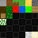
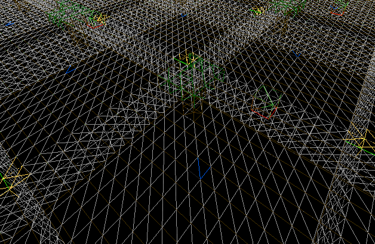

[..](../index.html)

https://youtu.be/ebeRZVHslO0?si=uE_04MIgKDC6BiLW&t=276
https://github.com/meemknight/minecraftGl/ source code

AMBIENT OCCLUSION HERE https://youtu.be/Ab8TOSFfNp4?si=9BFFB7KtQ7bAEs1s&t=2044

fps optimization techniques

This is my first attempt at trying to recreate *Minecraft* in C++ with OpenGL.

Both [jdh's video](https://www.youtube.com/watch?v=4O0_-1NaWnY) and [Low Level Game Dev's series](https://www.youtube.com/watch?v=KK-s0FZ-2oY&list=PLKUl_fMWLdH-0H-tz0S144g5xXliHOIxC) on the subject were a huge inspiration for this (as well as the source code of their projects). The [Let's Make A Voxel Engine](https://sites.google.com/site/letsmakeavoxelengine/) website was also interesting.
I'm going to re-explain some concepts here, but check out their videos for more detail.

# Rendering blocks

<!-- I also added the [camera.h] and [shader.h] files from [LearnOpenGL] since they provide basic functions. -->

First, let's render blocks to the screen.

We only have to store a block's position and type. Since blocks are going to be stored in chunks (more on that later), we can define them as numbers.

*Though, if we had to store more information in a block, then a `Block` class would have been necessary.*

```cpp
using Block = unsigned char; // 256 possible blocks

enum BlockType {
	STONE, DIRT, SAND, (...)
};
```

<div class="sideside" markdown="1">
For texturing, I'm going to use a single image called a texture atlas. It's an image containing all of the game's textures, this way we only have to send one texture to the shaders. Then, the idea is to "select" a texture using UVs. Here's the one I made:
{: .tleft }

{: .imright }
</div>

After loading it with [`stb_image.h`](https://github.com/nothings/stb/blob/master/stb_image.h), I defined more data:

```cpp
// defines an offset in the texture atlas
struct BlockFace {
	int x;
	int y;
};

// now define offsets for each texture in the atlas
BlockFace stone = { 0, 0 };
BlockFace dirt = { 1, 0 };
BlockFace grass = { 2, 0 };
(...)

// define which texture goes on which face for each block
// order: back, front, left, right, bottom, top
BlockFace faceTexture[][6]{
	{ stone, stone, stone, stone, stone, stone },    // STONE
	{ dirt, dirt, dirt, dirt, dirt, dirt },	         // DIRT
	{ dirt, dirt, dirt, dirt, dirt, grass },	 // GRASS
	(...)
};
```

This makes it easy to add a new block: add a value in the `BlockType` enum, define more `BlockFace` texture coordinates (if needed) and add a new element to `faceTexture`.

I'm sending the cube UVs `TexCoord` (between 0 and 1) and the texture offset `TexOffset` to the vertex shader. To sample the right texture using an offset, I use `TexCoord = (TexCoord + TexOffset) / n_textures`, with `n_textures` being the number of textures in a line/column in the atlas.

<figure style="display: inline-block">

</figure>
<figure style="display: inline-block">

</figure>
<figure style="display: inline-block">

</figure>
<figure style="display: inline-block">

</figure>

// (easily indiceable by a BlockType to fetch the right textures)

## Chunks

The world is going to be divided in chunks of `16 * 256 * 16` blocks.

The `Chunk` class stores blocks in a `Block blockData[CHUNK_SIZE][HEIGHT_LIMIT][CHUNK_SIZE]` 3D array. It also stores its own position in the world grid.

Now let's say we want to render a completely filled chunk (65536 blocks). 65536 draw calls for each block is going to be **very** expensive performance-wise.

This is why I'm using a method called "baking" the chunk before rendering it: this means constructing a single mesh for the chunk, making it cost only one draw call to render.

We just have to iterate over each block, and if it's not `BlockType::AIR`, we add its 6 faces to the mesh.

<figure style="display: inline-block">

<figcaption>5x5 cube</figcaption>
</figure>
<figure style="display: inline-block">

<figcaption>wireframe render (4500 triangles)</figcaption>
</figure>

Now, there's still room for optimization...

Some faces won't ever be visible, so to bring down the triangle count, we can check if a face is "free" before adding it to the mesh (if a solid block is in front of a face, we don't render the face).

I also enabled face culling, which doesn't remove triangles, but makes OpenGL render less geometry.

<figure style="display: inline-block">

<figcaption>with face checking (900 triangles)</figcaption>
</figure>
<figure style="display: inline-block">

<figcaption>with face culling</figcaption>
</figure>

More optimization (like greedy meshing algorithms) could have been added but I'll keep it like this for now.

There are two methods for rendering chunks:
- "bake" the chunk: construct a single mesh to render the entire chunk
    - problem: when destroying or placing a block, has to recalculate the entire mesh
- have flags in the `Block` class telling us which of the 6 faces to render
    - good: when destroying/placing a block, only recalculate faces of 6 adjacent blocks

i chose the bake method because it turns out recalculating the entire mesh isn't that expensive (the chunk is *only* 16*16*256). (plus, for placing blocks, we could afford not recalculating the mesh and just adding to it NO)
after testing, if the **entire** chunk is filled (65536 blocks), the mesh takes a little more than 1 second to build.

naive approach: add everything for each block
when "baking" the chunk: construct a mesh with vertices (for each vertex but also texture for face): { position, uv, texture }


# Infinite world
## Multiple chunks

Now we need to generate chunks as the player moves around.

After some research, I decided to build my `ChunkManager` class like this (simplification):

```cpp
class ChunkManager {

    std::vector<Chunk*> loadedChunks; // keep references to all the loaded chunks
    std::vector<Chunk*> unbuiltChunks; // chunks that are not baked yet (no mesh)
    std::vector<glm::ivec2> toLoadPositions; // chunk positions to load
    
    Chunk **visibleChunks; // subset of loadedChunks
    int visibleChunks_size;

    void update(Player *player) {
        // 1.
        toLoadPositions.clear();
        requestChunkPositions(player, &toLoadPositions);
        visibleChunks_size = toLoadPositions.size();
        // 2.
        requestChunks(visibleChunks, &toLoadPositions);
        // 3.
        buildUnbuiltChunks(player);
    }
}
```

Some explanation here:

1. We want to fetch the positions of the $$ (RenderDistance * 2 + 1)^2 $$ chunks around the player. `requestChunkPositions(player, &toLoadPositions)` loads these positions in the `toLoadPositions` vector.

2. Now, we want the actual references of the chunks. `requestChunks(visibleChunks, &toLoadPositions)` iterates over `toLoadPositions`. For each position, it looks into `loadedChunks` to see if the requested chunk is already in memory:
    - If it is, the reference is added to `visibleChunks`.
    - If it is not, a new chunk is allocated and added to `loadedChunks`, `unbuiltChunks` and `visibleChunks`.
    
3. Then, we want to build chunks that have not been baked yet.

The rendering function simply loops over `visibleChunks`, and if the chunk is built, then it calls its `Chunk::render(Shader *shader)` function.

Here's a test with chunks that only contain 7 blocks:

<figure style="display: inline-block">

<figcaption>chunks are loaded as the player moves around</figcaption>
</figure>

The problem is that baking a chunk takes time! So instead of baking the entire `unbuildChunks` vector, let's sort it by distance to the player and bake only the first element each frame.

```cpp
void buildUnbuiltChunks(Player *player) {
    if (unbuiltChunks.size() != 0) {
        glm::ivec2 chunk_pos = getChunkPosition(&player->position);

        std::sort(unbuiltChunks.begin(), unbuiltChunks.end(),
            [chunk_pos](const auto& chunk_a, const auto& chunk_b) {
                return dist(chunk_a, chunk_pos) < dist(chunk_b, chunk_pos)
        });

        Chunk *chunk = unbuiltChunks[0];
        chunk->bakeMesh();
        
        unbuiltChunks.erase(unbuiltChunks.begin());
    }
}
```

<figure style="display: inline-block">

<figcaption>classic Minecraft chunk loading</figcaption>
</figure>

At this point, when in a loaded zone, the game runs at around 30 FPS with `RENDER_DISTANCE = 5` (121 chunks). We can still optimize a bit more.

<!--But it comes down to a terrible 13 FPS when it's baking everything... So there is still some optimization to find.-->

First, faces between chunks are rendered even though we can't see them.

<figure style="display: inline-block">

<figcaption>faces between chunks</figcaption>
</figure>

To fix this, I added a `Chunk *neighbours[4]` variable to the `Chunk` class. This way, when it checks if a face on the chunk's border is free, it can look into the neighbour chunk's data.

<figure style="display: inline-block">

<figcaption>correct meshes</figcaption>
</figure>

Then, remember I'm running a *for* loop on each loaded chunk, each frame. This means that the less chunks there are in `loadedChunks`, the faster the loop will end.

So I added a `checkFarChunks(Player *player)` function to remove chunks from `loadedChunks` if they are too far **and** haven't been modified by the player.

FORMULA FOR HOW MUCH MEMORY - mc is 3GB for 64 render distance and 2 for 32
at 20 render distance on my minecraft, it takes 4,3 GB

# World generation

It's finally time to get into world generation! I'm using the [FastNoise2 library](https://github.com/Auburn/FastNoise2) for everything noise-related.

I went over different generation techniques in [this article](https://aedorian.github.io/blug/_posts/2024-07-18-planet.html#2), so check it out if you're interested.

*Minecraft* uses a 3D noise for their generation, but I'm only going to be using a 2D heightmap here.


## Placing trees


# Breaking and placing blocks

(raycast)

REBUILD NEIGHBORING CHUNKS IF BLOCK WAS ON A LIMIT (also corners: do both)
MORE OPTI: get highest block to determine height limit to stop when building mesh (small changes)

revuilding is BAD? yes or no


FOG: more blue with distance? like irl


# References

to optimize: build mesh, the request chunks function, render calls