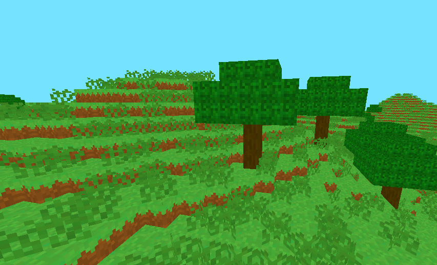

[..](../index.html)

# Minecraft engine with OpenGL

- [Rendering blocks](#1)
- [Infinite world](#2)
- [World generation](#3)
- [Breaking and placing blocks](#4)

<!--https://youtu.be/Ab8TOSFfNp4?si=9BFFB7KtQ7bAEs1s&t=2044-->

This is my first attempt at trying to recreate *Minecraft* in C++ with OpenGL.

Both [jdh's video](https://www.youtube.com/watch?v=4O0_-1NaWnY) and [Low Level Game Dev's series](https://www.youtube.com/watch?v=KK-s0FZ-2oY&list=PLKUl_fMWLdH-0H-tz0S144g5xXliHOIxC) on the subject were a huge inspiration for this (as well as the source code of their projects).

<!--The [Let's Make A Voxel Engine](https://sites.google.com/site/letsmakeavoxelengine/) website was also interesting.-->

The [source code of this project](https://github.com/aedorian/kraf) is also available if you'd like to check it out.

# <a name="1"></a>Rendering blocks

<!-- I also added the [camera.h] and [shader.h] files from [LearnOpenGL] since they provide basic functions. -->

First, let's render blocks to the screen.

We only have to store a block's position and type. Since blocks are going to be stored in chunks (more on that later), we can define them as numbers.

<!--*Though, if we had to store more information in a block, then a `Block` class would have been necessary.*-->

```cpp
using Block = unsigned char; // 256 possible blocks

enum BlockType {
	STONE, DIRT, SAND, (...)
};
```

<div class="sideside" markdown="1">
For texturing, I'm going to use a single image called a **texture atlas**. It's an image containing all of the game's textures: this way we only have to send one texture to the shaders. Then, the idea is to "select" a texture using UVs. Here's the one I made:
{: .tleft }

{: .imright }
</div>

After loading it with [`stb_image.h`](https://github.com/nothings/stb/blob/master/stb_image.h), I defined more data:

```cpp
// defines an offset in the texture atlas
struct BlockFace {
	int x;
	int y;
};

// now define offsets for each texture in the atlas
BlockFace stone = { 0, 0 };
BlockFace dirt = { 1, 0 };
BlockFace grass = { 2, 0 };
(...)

// define which texture goes on which face for each block
// order: back, front, left, right, bottom, top
BlockFace faceTexture[][6]{
	{ stone, stone, stone, stone, stone, stone },    // STONE
	{ dirt, dirt, dirt, dirt, dirt, dirt },	         // DIRT
	{ dirt, dirt, dirt, dirt, dirt, grass },	 // GRASS
	(...)
};
```

This makes it easy to add a new block: add a value in the `BlockType` enum, define more `BlockFace` texture coordinates (if needed) and add a new element to `faceTexture`.

I'm sending the cube UVs `TexCoord` (between 0 and 1) and the texture offset `TexOffset` to the vertex shader. To sample the right texture using an offset, I use `TexCoord = (TexCoord + TexOffset) / n_textures`, with `n_textures` being the number of textures in a line/column in the atlas.

<figure style="display: inline-block">

</figure>
<figure style="display: inline-block">

</figure>
<figure style="display: inline-block">

</figure>
<figure style="display: inline-block">

</figure>

<!--// (easily indiceable by a BlockType to fetch the right textures)-->

## Chunks

The world is going to be divided in chunks of `16 * 256 * 16` blocks.

The `Chunk` class stores blocks in a `Block blockData[CHUNK_SIZE][HEIGHT_LIMIT][CHUNK_SIZE]` 3D array. It also stores its own position in the world grid.

Now let's say we want to render a completely filled chunk (65536 blocks). 65536 draw calls for each block is going to be **very** expensive performance-wise.

This is why I'm using a method called "baking" the chunk: this means constructing a single mesh for the entire chunk, making it cost only one draw call to render.

We just have to iterate over each block, and if it's not `BlockType::AIR`, we add its 6 faces to the mesh. <!-- { position, uv, texture } -->

<figure style="display: inline-block">

<figcaption>5x5 cube</figcaption>
</figure>
<figure style="display: inline-block">

<figcaption>wireframe render (4500 triangles)</figcaption>
</figure>

Now, there's still room for optimization...

Some faces won't ever be visible, so to bring down the triangle count, we can check if a face is "free" before adding it to the mesh (if a solid block is in front of a face, we don't render the face).

I also enabled face culling, which doesn't remove triangles, but makes OpenGL render less geometry.

<figure style="display: inline-block">

<figcaption>with face checking (900 triangles)</figcaption>
</figure>
<figure style="display: inline-block">

<figcaption>with face culling</figcaption>
</figure>

More optimization (like greedy meshing algorithms) could have been added but I'll keep it like that for now.

# <a name="2"></a>Infinite world

Now we need to generate chunks as the player moves around.

After some research, I decided to build my `ChunkManager` class like this (simplified):

```cpp
class ChunkManager {

    std::vector<Chunk*> loadedChunks; // keeps references to all the loaded chunks
    std::vector<Chunk*> unbuiltChunks; // chunks that are not baked yet (no mesh)
    std::vector<glm::ivec2> toLoadPositions; // chunk positions to load
    
    Chunk **visibleChunks; // subset of loadedChunks
    int visibleChunks_size;

    void update(Player *player) {
        // 1.
        toLoadPositions.clear();
        requestChunkPositions(player, &toLoadPositions);
        visibleChunks_size = toLoadPositions.size();
        // 2.
        requestChunks(visibleChunks, &toLoadPositions);
        // 3.
        buildUnbuiltChunks(player);
    }
}
```

Some explanation here:

1. We want to fetch the positions of the $$ (RenderDistance * 2 + 1)^2 $$ chunks around the player. `requestChunkPositions()` loads these positions in the `toLoadPositions` vector.

2. Now, we want the actual references of the chunks. `requestChunks()` iterates over `toLoadPositions`. For each position, it looks into `loadedChunks` to see if the requested chunk is already in memory:
    - If it is, the reference is added to `visibleChunks`.
    - If it is not, a new chunk is allocated and added to `loadedChunks`, `unbuiltChunks` and `visibleChunks`.
    
3. Then, we build the chunks that have not been baked yet.

The rendering function simply loops over `visibleChunks`, and if the chunk is built, then it calls its `Chunk::render(Shader *shader)` function.

Here's a test with small chunks that only contain 7 blocks:

<figure style="display: inline-block">

<figcaption>chunks are loaded as the player moves around</figcaption>
</figure>

The problem is that baking a chunk takes time! So instead of baking the entire `unbuildChunks` vector, let's sort it by distance to the player and bake only the first element each frame.

```cpp
void buildUnbuiltChunks(Player *player) {
    if (unbuiltChunks.size() != 0) {
        glm::ivec2 chunk_pos = getChunkPosition(&player->position);

        std::sort(unbuiltChunks.begin(), unbuiltChunks.end(),
            [chunk_pos](const auto& chunk_a, const auto& chunk_b) {
                return dist(chunk_a, chunk_pos) < dist(chunk_b, chunk_pos)
        });

        Chunk *chunk = unbuiltChunks[0];
        chunk->bakeMesh();
        
        unbuiltChunks.erase(unbuiltChunks.begin());
    }
}
```

<figure style="display: inline-block">

<figcaption>classic Minecraft chunk loading</figcaption>
</figure>

At this point, within loaded zone, the game runs at around 30 FPS with `RENDER_DISTANCE` set to 5 (121 chunks). We can still optimize a bit more.

<!--But it comes down to a terrible 13 FPS when it's baking everything... So there is still some optimization to find.-->

First, faces between chunks are rendered even though we can't see them.

<figure style="display: inline-block">

<figcaption>faces between chunks</figcaption>
</figure>

To fix this, I added a `Chunk *neighbours[4]` variable to the `Chunk` class. This way, when we check if a face on the chunk's border is free, it can look into the neighbouring chunk's data.

<figure style="display: inline-block">

<figcaption>correct meshes</figcaption>
</figure>

Also, remember I'm running a *for* loop on each loaded chunk, each frame. This means that the less chunks are in `loadedChunks`, the faster the loop will end.

So I added a `checkFarChunks(Player *player)` function to remove chunks from `loadedChunks` if they are too far **and** haven't been modified by the player.

<!--
*Another optimization note from the code: I was using a vector and pushing every float value in it to generate the mesh data. Instead, now I allocate an array of float and directly add the elements at an index. When I know how much floats I added, I just `realloc` the array with the correct size. This made the chunk mesh generation go from around 0.07 seconds to 0.003 seconds.*

*Also, I made it so the `requestChunks()` function only gets called when the player moves in the X or Z axis.*-->

# <a name="3"></a>World generation

It's finally time to get into world generation! I'm using the [FastNoise2 library](https://github.com/Auburn/FastNoise2) for everything noise-related. *Minecraft* uses a 3D noise for its generation, but I'm only going to be using a 2D heightmap for now.

I went over other generation techniques in [this article](https://aedorian.github.io/blug/_posts/2024-07-18-planet.html#2), so check it out if you're interested.

The `World` class is used to store a `ChunkManager`, a seed and noise parameters.

A `World::generateChunk(Chunk *c)` function fills a chunk's block data using noises. Here's a first test:

<figure style="display: inline-block">

<figcaption>little hills and a blue sky</figcaption>
</figure>

<!--<figure style="display: inline-block">

<figcaption>little hills and a blue sky</figcaption>
</figure>-->

## Placing trees

I decided to keep the terrain simple at first and went on to place trees (which are going to be defined as structures in the world). I made a new `struct` to store a structure:

```cpp
struct Structure {
    int blocks[20][8*8]; // y, xz
    glm::ivec3 dim;
};

Structure tree = {
    {
       {0,0,0,0,0, // indices of each BlockType (easier to read)
        0,0,0,0,0,
        0,0,6,0,0,
        0,0,0,0,0,
        0,0,0,0,0},
        (...)
    },
    {5, 6, 5} // dimensions of the structure (x, y, z)
};
```

<div class="sideside" markdown="1">
I made a `World::placeStructure(Structure *s, Chunk *c)` function to place structures. Using another noise, I computed forest patches and gave trees a $$ 1 / 100 $$ chance of spawning in a forest. But there's a problem... Since this tree must have been placed on the side of a chunk, half of it got cut out.
{: .tleft }

{: .imright }
</div>

The idea to fix this is, when a block can't be placed by the `placeStructure()` function because its coordinates are out of bounds, the `World` object needs to remember and "cache" this block.
To stored cached blocks, I made a simple `struct CachedBlock` containing a block type and its position.

I used a `std::map<int, std::vector<CachedBlock>>` object to store which blocks were cached in which chunks (with the map's keys being a chunk's hash code calculated using its position).
  
Now when a block can't be placed in a chunk by `placeStructure()`, it finds the right neighbouring chunk `c` to place it in. The new `CachedBlock` is added to the `cachedBlocks[hashCode(c)]` vector.

Finally, when a chunk is requested, we check in `cachedBlocks` if there are any cached blocks in this chunk. If so, we place the blocks and add the chunk back to `unbuiltChunks` to recalculate its mesh.

<figure style="display: inline-block">

<figcaption>cached blocks shown in red</figcaption>
</figure>
<figure style="display: inline-block">

<figcaption>no cut-out trees</figcaption>
</figure>

Since terrain is quite empty like this, i wanted to add grass as well. In *Minecraft*, the grass block model is actually two intersected quads. So I just added a separate mesh type that can be added when the chunk bakes its mesh.

<figure style="display: inline-block">

<figcaption>grass and trees</figcaption>
</figure>

Then I decided to actually give more shape to the terrain using techniques that are described in [this video](https://youtu.be/CSa5O6knuwI?si=HhkVDoGLRmc1wfQF&t=936) (basically another noise and a spline to decide the block height).

<figure style="display: inline-block">

<figcaption>chinese mountains?</figcaption>
</figure>
<figure style="display: inline-block">

<figcaption>small plateau</figcaption>
</figure>

<!-- With this system in place, adding structures was actually really easy so I also added towers: -->

## Ambient occlusion

Even though I liked this "no lighting whatsoever" look, I needed to add ambient occlusion to distinguish blocks more easily.

I based my code on [this article on 0fps.net](https://0fps.net/2013/07/03/ambient-occlusion-for-minecraft-like-worlds) about voxel-based ambient occlusion (AO).

<div class="sideside" markdown="1">
The take-away here is that each vertex can have one of 4 AO values (between 0.0 and 1.0) calculated using the corner and side blocks. Then, in the fragment shader, the block's color is multiplied by the vertex's AO value, effectively darkening certain edges. Here's a visualization with disabled textures:
{: .tleft }

{: .imright }
</div>

<figure style="display: inline-block">

<figcaption>desert with rock structures and cacti</figcaption>
</figure>

## Day-night cycle

For more visual effects, I tried adding a day-night cycle.

There are two blocks (Sun and Moon) rotating around the player. I'm rendering them before I render the world, so that they're always in the background.

Then, instead of using a constant clear color for the sky, I sample a color gradient with a `World.time` variable.

I also calculate a lighting value based on time, and send it to the block shader as a uniform. This effectively makes the blocks darker at night.

Here's a GIF showing the effect (with a high time speed):

<figure style="display: inline-block">

<figcaption>Florida circa 2000</figcaption>
</figure>

# <a name="4"></a>Breaking and placing blocks

It's probably the most important gameplay mechanic, but I kept it for last...

I'm going to use a **raycast** to detect which block is being looked at. <!--Its origin is going to be the camera's position.-->

First, we get the chunk where the camera currently is. This is going to be the initial `currentChunk`. The initial ray position is the camera's position.

Then, we loop while the max raycast distance is respected, and the current ray position isn't inside a solid block. We add a bit of the camera's $$\vec{front}$$ vector to the ray position at each step.

We also need to check if the ray is going out of the <span style="color:#4242ff;">current chunk's bounds</span>. If it is, just switch chunks using the current chunk's neighbors.

<figure style="display: inline-block">

<figcaption><span style="color:red;">selected block</span> is outside of the current chunk</figcaption>
</figure>

Once we know the targeted block and the chunk in which it is, it's easy to break it. When a block is broken, the chunk's mesh has to be baked again.

We also need to recalculate the neighbouring chunk's meshes if the broken block was on a border. We can afford baking them all at once since there will be at worst 3 meshes to recalculate. Also, the result has to be instantaneous.

## Placing blocks

The raycast function also gives us the coordinates of the adjacent block to the face that was hit. This is useful for knowing where to place a block.

I made a `Block inventory[9]` array, and made the currently selected block render to the corner of the screen. The player can select blocks by scrolling the mouse.

<figure style="display: inline-block">

<figcaption>inventory</figcaption>
</figure>
<figure style="display: inline-block">

<figcaption>placing and breaking blocks</figcaption>
</figure>

Now we can build a little house!

<figure style="display: inline-block">

</figure>

The basic features are now working. I'm going to stop adding some for now, but there could be a lot more to cover.

<!--
make better raycast thing (for faces too)

something to not have to loop through loadedChunks every time (loaded flag?)
request chunks using those which disappeared?

use a separate array for storing the chunk positions that are already loaded?? instead of looking through loadedChunks

to optimize: build mesh, the request chunks function, render calls
-->