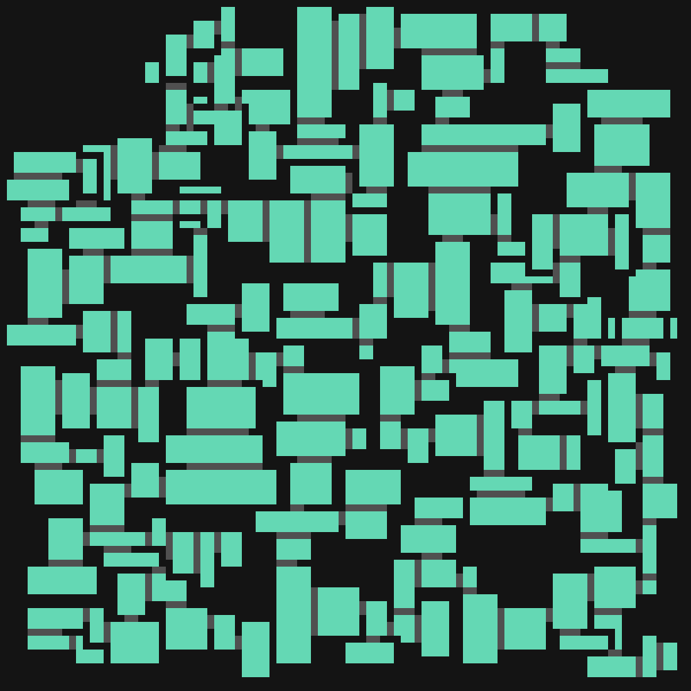

# Portfolio - Autres

[`Jeux vidéo`](../_posts/2024-09-03-pf-jeux.html)
[`Game Jams`](../_posts/2024-09-03-pf-jams.html)
[`Musique`](../_posts/2024-09-03-pf-musique.html)
[`Autres`](../_posts/2024-09-03-pf-autres.html)

# *Blug* (2023)

[`Accéder à la page d'accueil`](../index.html)

Rédaction de petits articles en anglais sur certains projets de programmation. Le sujet principal est souvent la génération procédurale de niveaux.

Généré statiquement avec `Jekyll`, stylisé avec `CSS`.

# *Speed Sketch* (2019)

Application de dessin pour bureau en `Python`, avec les modules `Tkinter` et `PIL`. Permet de copier directement une image dans le presse-papier, afin de la coller le plus rapidement possible dans une conversation Discord. Possède plusieurs effets d'image, dont un permettant de transformer une image en lettres.

# *Svordakus* (2024)

Jeu de duel à l'épée en multijoueur local pour Android, avec Unity. Encore en développement, le retour des joueurs est très utile pour améliorer l'expérience utilisateur. Comprend plusieurs modes de jeu, une trentaine d'armes différentes et une dizaine de cartes.

<figure style="display: inline-block">

</figure>
<figure style="display: inline-block">

</figure>
