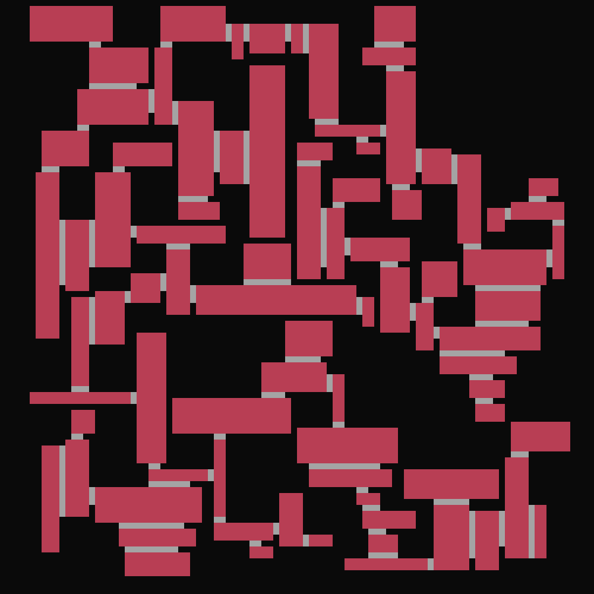
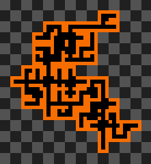

## Portfolio - Autres

[`Jeux vidéo`](../_posts/2024-09-03-pf-jeux.html)        
[`Game Jams`](../_posts/2024-09-03-pf-jams.html)        
[`Musique`](../_posts/2024-09-03-pf-musique.html)        
[`Autres`](../_posts/2024-09-03-pf-autres.html)        

Autres projets liés à la programmation et aux jeux vidéo.

---

# *Blug* (2023-2024)

[`Accéder à la page d'accueil`](../index.html)

Rédaction de petits articles en anglais sur certains projets personnels. Le sujet principal est souvent la génération procédurale de niveaux.

Généré statiquement avec `Jekyll` et stylisé avec `CSS`.

<figure style="display: inline-block">

</figure>
<figure style="display: inline-block">

</figure>

---

# *Speed Sketch* (2019)

Application de dessin pour bureau en `Python`, avec les modules `Tkinter` et `PIL`.

Permet de copier directement une image dans le presse-papier, afin de la coller le plus rapidement possible dans une conversation Discord. Possède plusieurs effets d'image, dont un permettant de transformer une image en matrice de lettres.

<figure style="display: inline-block">

</figure>
<figure style="display: inline-block">

</figure>

---

# Chaîne YouTube (2016-2020)

Test de jeux indépendants en vidéo. Montage avec Adobe Premiere Pro. Les vidéos étant désormais archivées en privé, [`en voici une.`](https://youtu.be/aBg-qeTYAok?si=l7A9hZba2_smUpkC)