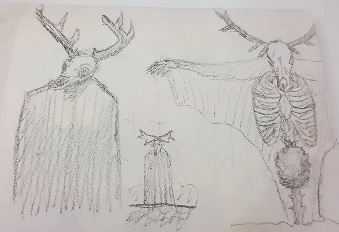
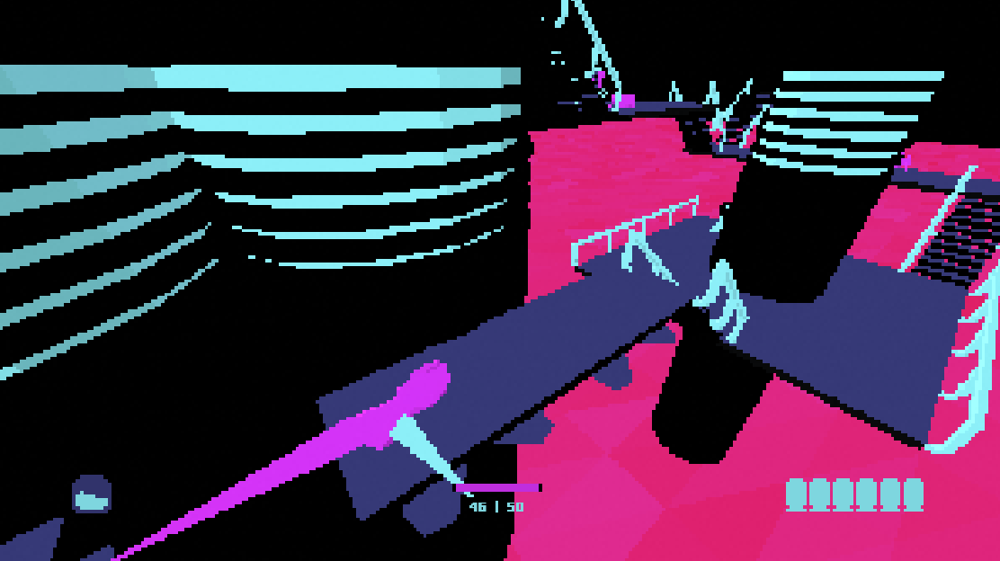
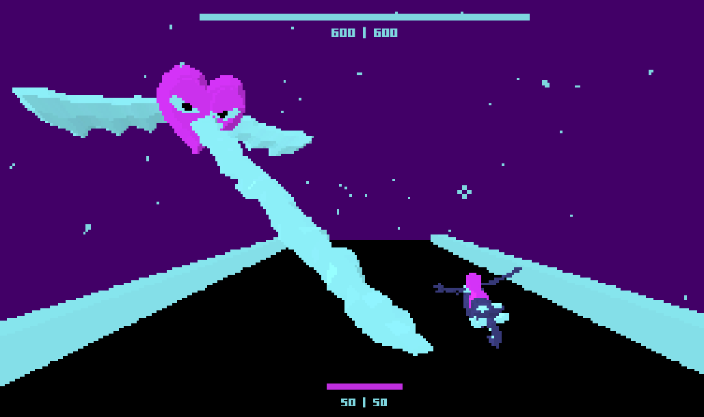
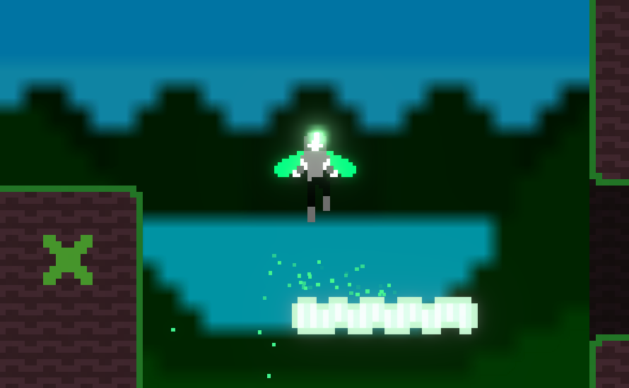
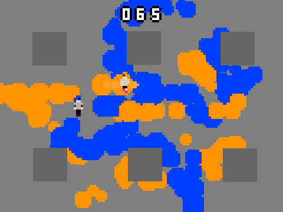
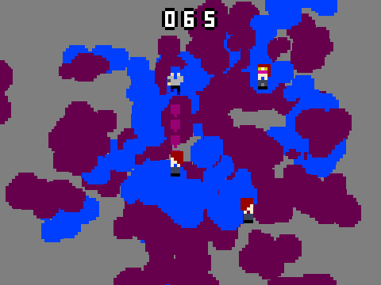

---

---

## Portfolio - Game Jams

[`Jeux vidéo`](../_posts/2024-09-03-pf-jeux.html)        
[`Game Jams`](../_posts/2024-09-03-pf-jams.html)        
[`Musique`](../_posts/2024-09-03-pf-musique.html)        
[`Autres`](../_posts/2024-09-03-pf-autres.html)        

Depuis 2018, j'ai pu participer à de nombreuses Game Jams. Voici certains jeux développés pour ces occasions. Sauf précisé, les concepts, le code, la bande son et les graphismes sont de moi.

[`Accéder au compte Itch.io précédent (2018-2021)`](https://zapdexio.itch.io/)

[`Accéder au compte Itch.io actuel (2022-2024)`](https://aedorian.itch.io/)

---

# *Mob Fight* (*1-Bit Jam #2*, 2023)

[`Accéder à la page du jeu`](https://itch.io/jam/1-bit-jam-n2/rate/2374393)

Jeu de combat par vagues vu de dessus avec Unity. À l'inverse d'une progression classique où le joueur gagne un pouvoir à la fin de chaque vague, ici, le joueur commence avec tous les bonus et en perd un à chaque tour.

<figure style="display: inline-block">

</figure>
<figure style="display: inline-block">

</figure>

---

# *0percule* (2022)

Jeu d'aventure développé en 1 mois pour une Game Jam organisée avec des amis. Obligation d'utiliser une palette de couleurs restreinte.

Conceptualisation des créatures et ennemis du jeu (croquis à droite). Les retours des autres participants ont été importants pour le peaufinage du gameplay.
{: .tleft }

{: .imright }

La bande son a été composée avec Ableton. L'idée était d'enregistrer des guitares saturées, puis de descendre leur bitrate afin de créer un effet rétro.

<figure style="display: inline-block">

</figure>
<figure style="display: inline-block">

</figure>

Voici une vidéo d'une version encore en développement lors de son enregistrement. La bande son y est audible.

<iframe width="750" height="422" src="https://www.youtube.com/embed/8MC6FzUxNzI?si=Kz2l4N3gAtIepD9Z" title="YouTube video player" frameborder="0" allow="accelerometer; autoplay; clipboard-write; encrypted-media; gyroscope; picture-in-picture; web-share" allowfullscreen></iframe>

---

# *Neon Lines* (*Mini Jam #58*, 2020)

[`Accéder à la page du jeu`](https://zapdexio.itch.io/neon-lines)

Jeu de tir vu de dessus créé en 3 jours avec Unity. En équipe avec un ami qui a pu composer une bande son synthwave. Pour suivre le thème, j'ai fait en sorte que les points de vie soient aussi les munitions restantes pour tirer.

<figure style="display: inline-block">

</figure>
<figure style="display: inline-block">

</figure>
<figure style="display: inline-block">

</figure>

---

# *Forsaken Feelings* (*Mini Jam #51*, 2020)

[`Accéder à la page du jeu`](https://zapdexio.itch.io/forsaken-feelings)

Développé pendant le confinement avec Unity. 4 zones où le joueur débloque un pouvoir qui lui permet d'avancer plus loin. Toutes les images utilisées ont été créées avec Adobe Photoshop.

<figure style="display: inline-block">

</figure>
<figure style="display: inline-block">

</figure>
<figure style="display: inline-block">

</figure>

---

# *Jeux avec Scratch* (2018-2019)

Avant Unity, j'ai pu réaliser plusieurs jeux vidéo avec [`Scratch.`](https://scratch.mit.edu/) Voici quelques images, les jeux sont principalement trouvables en bas de [`cette page.`](https://zapdexio.itch.io/)

*The Intrepid's Tower*

<figure style="display: inline-block">

</figure>
<figure style="display: inline-block">

</figure>

*Dark Lighted Soul*

<figure style="display: inline-block">

</figure>
<figure style="display: inline-block">

</figure>

*For A Fistful Of Frogs*

<figure style="display: inline-block">

</figure>
<figure style="display: inline-block">

</figure>

*Sploon* (demake de *Splatoon*)

<figure style="display: inline-block">

</figure>
<figure style="display: inline-block">

</figure>

*Super Halloween Brawl*

<figure style="display: inline-block">

</figure>
<figure style="display: inline-block">

</figure>

