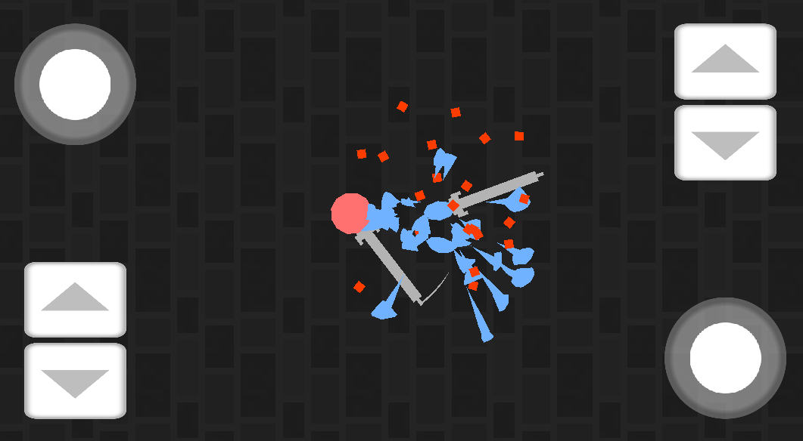
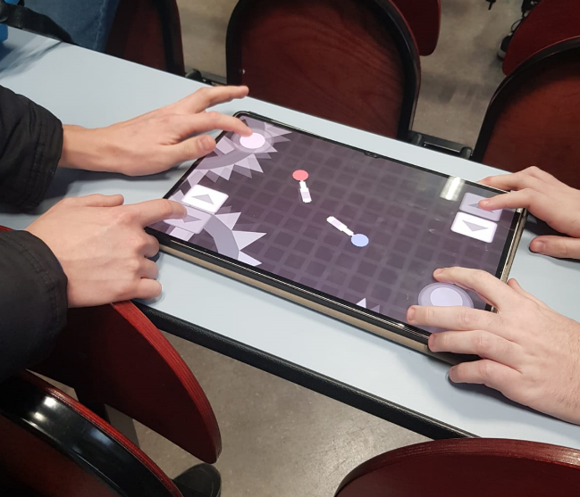
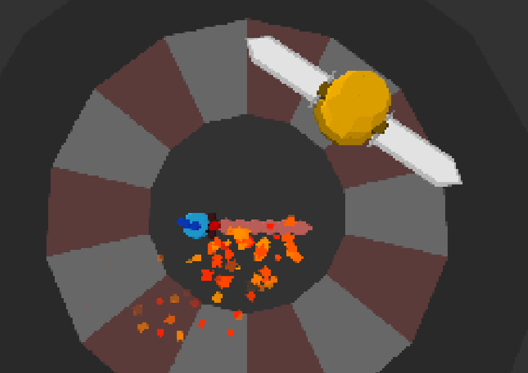
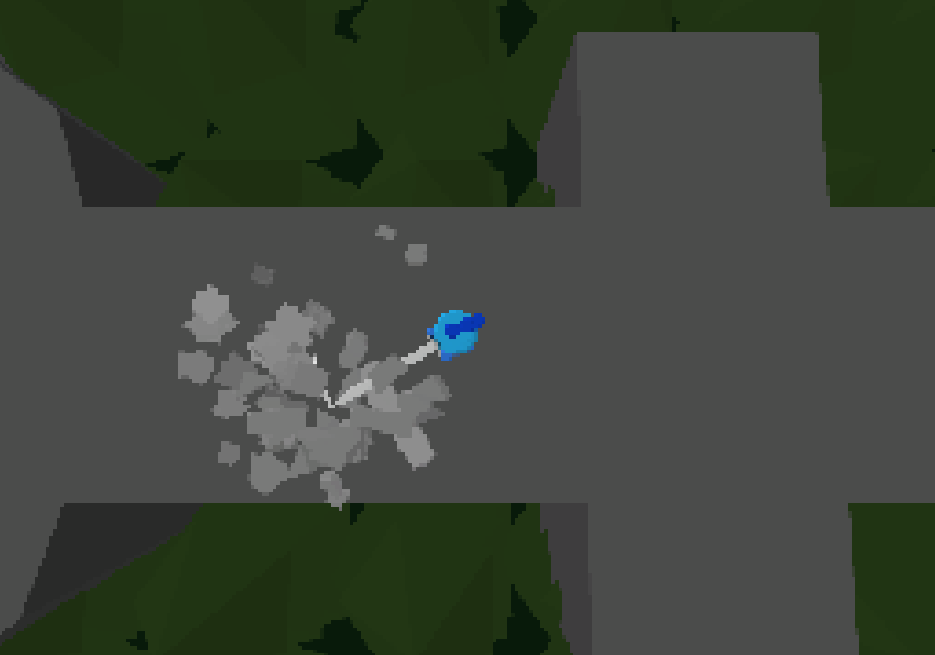

---

---

## Portfolio - Jeux vidéo

[`Jeux vidéo`](../_posts/2024-09-03-pf-jeux.html)        
[`Game Jams`](../_posts/2024-09-03-pf-jams.html)        
[`Musique`](../_posts/2024-09-03-pf-musique.html)        
[`Autres`](../_posts/2024-09-03-pf-autres.html)        

Projets de jeux vidéo plus importants que ceux réalisés lors de Game Jams.

---

# *Nuclear Platypus Adventure* (2019)

[`Accéder à la page du jeu`](https://zapdexio.itch.io/nuclear-platypus-adventure)

Jeu de plateformes en 2.5D développé sur une période d'un an (2018-2019) avec Unity.

Design des niveaux, modélisation 3D sur Blender, écriture de l'histoire, programmation et composition de la bande son. Le trailer ci-dessous a été monté avec Adobe Premiere Pro.

<iframe width="750" height="422" src="https://www.youtube.com/embed/rwln1nmNoCA?si=GCUnu9UniG4R2V7Y" title="YouTube video player" frameborder="0" allow="accelerometer; autoplay; clipboard-write; encrypted-media; gyroscope; picture-in-picture; web-share" allowfullscreen></iframe>

---

# *Svordakus* (2024)

Jeu de duel à l'épée en multijoueur local pour Android, avec Unity. Encore en développement, le retour des joueurs est très utile pour améliorer l'expérience utilisateur. Comprend plusieurs modes de jeu, une trentaine d'armes différentes et une dizaine de cartes.

<figure style="display: inline-block">

</figure>
<figure style="display: inline-block">

</figure>

Une version précédente en 3D à un seul joueur existe en tant que prototype.

<figure style="display: inline-block">

</figure>
<figure style="display: inline-block">

</figure>

---

# Projet de Programmation Impérative (2023)

[`Accéder au code source (Github)`](https://github.com/aedorian/proget)

Jeu à défilement vertical inspiré de la série de jeux *Touhou*. Développé en langage `C` à deux, à l'aide de la bibliothèque MLV (simplification de SDL).

Ma partie comprend surtout la création du moteur (gestion des entités: balles, joueurs, ennemis) et la création d'un système pour lire des vagues d'ennemis stockés dans des fichiers avec un format particulier.