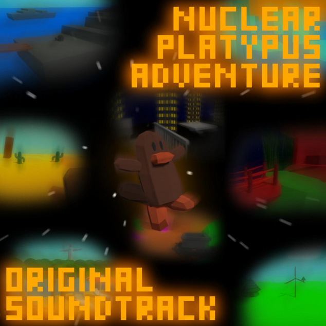
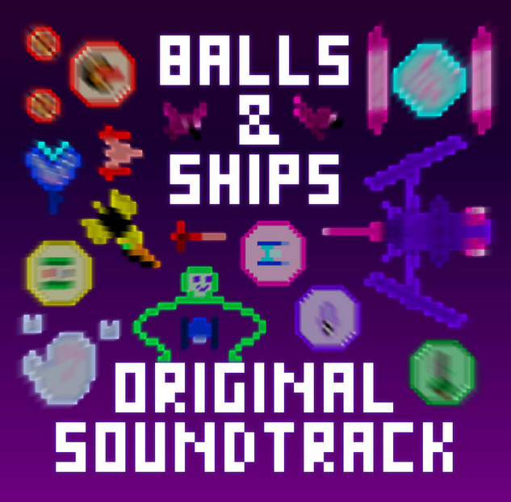

---

---

## Portfolio - Musique

[`Jeux vidéo`](../_posts/2024-09-03-pf-jeux.html)        
[`Game Jams`](../_posts/2024-09-03-pf-jams.html)        
[`Musique`](../_posts/2024-09-03-pf-musique.html)        
[`Autres`](../_posts/2024-09-03-pf-autres.html)        

Bandes son pour des jeux vidéo.

---

# *Nuclear Platypus Adventure* (2019)

[`Accéder au lien Spotify`](https://open.spotify.com/intl-fr/album/2v49RnlihjF9vrXW7NxJm6?si=MkVYGVg0RCSvs4lzgh2Q8Q)  
Bande son de 18 titres composée sur [`LMMS`](https://lmms.io/) pour *Nuclear Platypus Adventure*. Chaque niveau possède une musique de fond qui lui correspond, en adaptant le style musical.
{: .tleft }

{: .imright }

---

# *Balls & Ships* (2020)

[`Accéder au lien Spotify`](https://open.spotify.com/intl-fr/album/0uTmIJLUK3cBBAEwvOqm10?si=sc1peeNRQBGeqVcRnbSWng)  
Bande son de 9 titres composée avec LMMS pour le jeu d'une amie. Utilisation de plusieurs leitmotifs entre les niveaux.
{: .tleft }

{: .imright }

---

# *Angela Kills Joy* (2023-2024)

[`Accéder aux liens`](https://linktr.ee/angelakj)

Projet hors du cadre d'un jeu vidéo. Rock alternatif/grunge seul sur scène. Composition et enregistrement des parties de guitare, basse, batterie et chant. Enregistrement de deux EP en studio.
