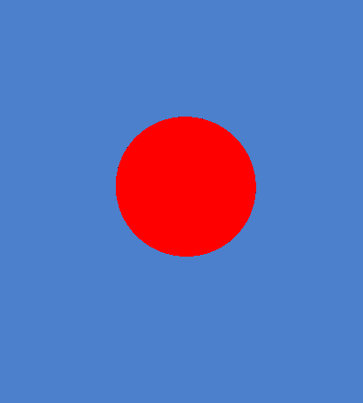
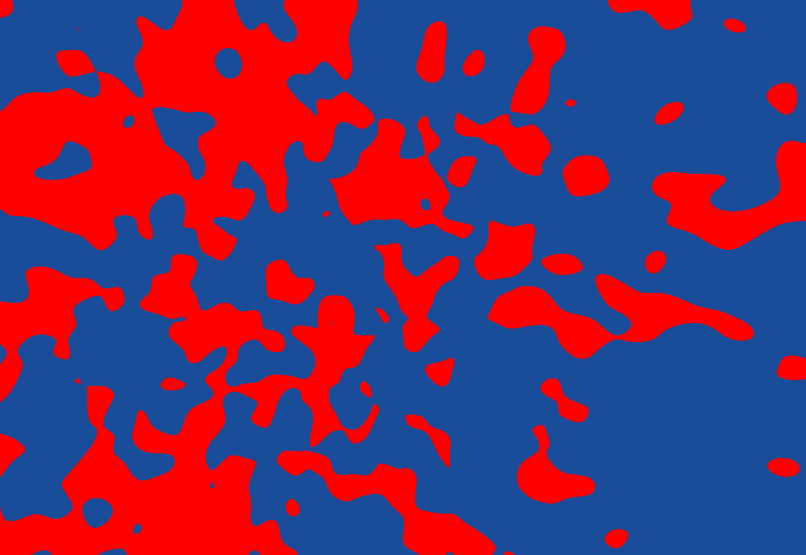
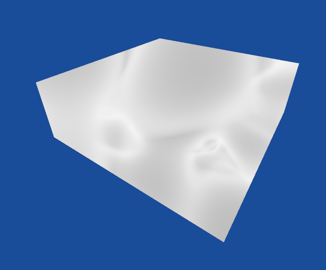
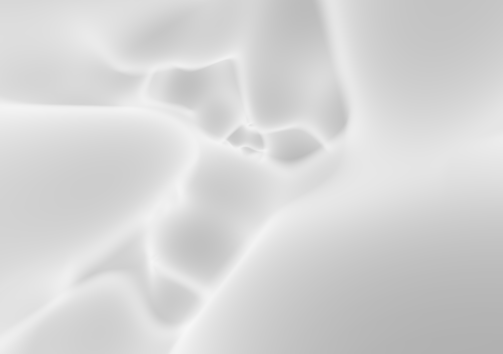
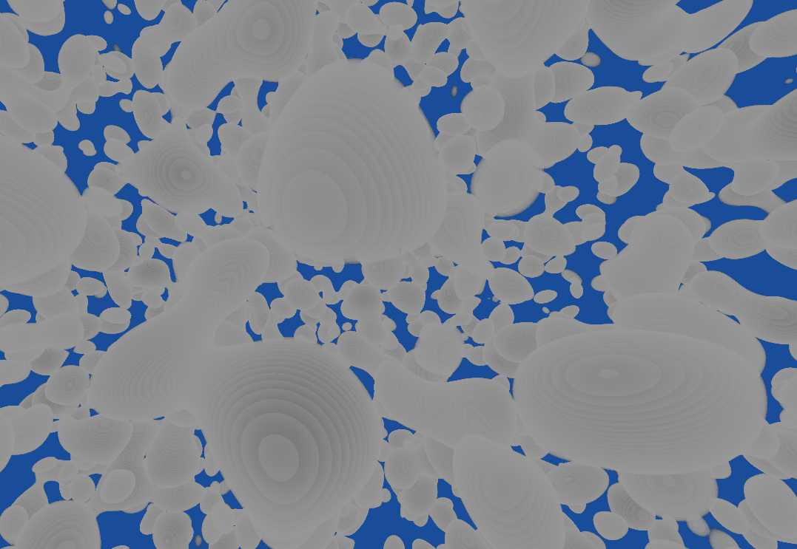
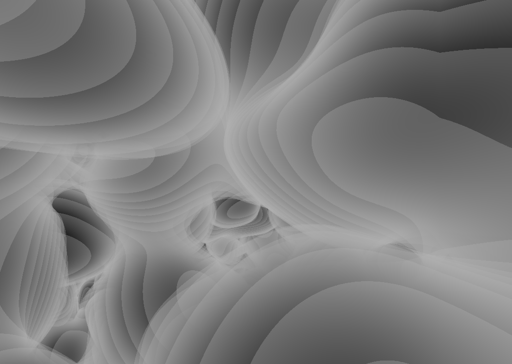
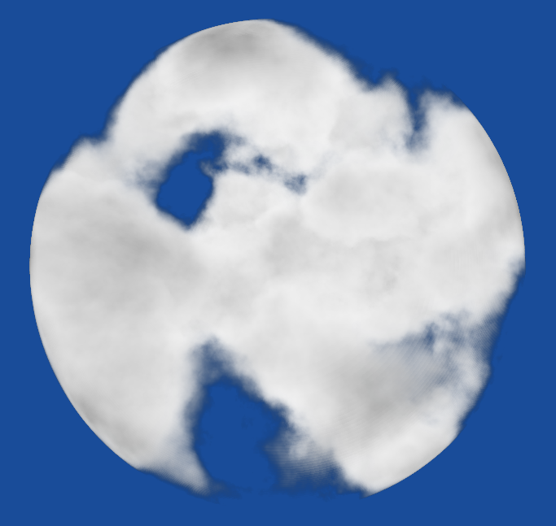
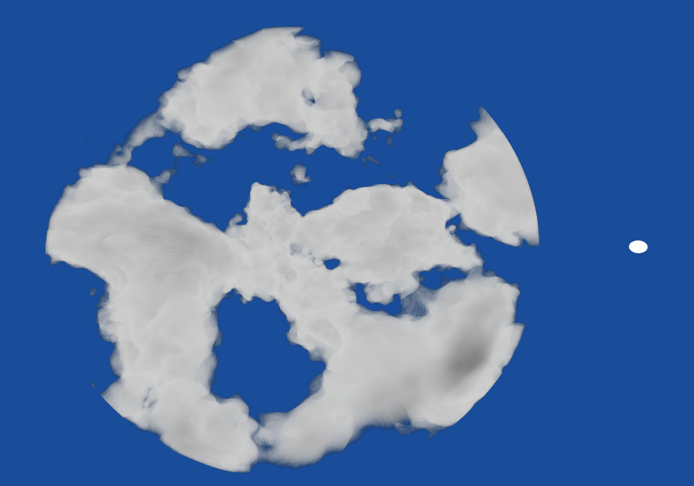
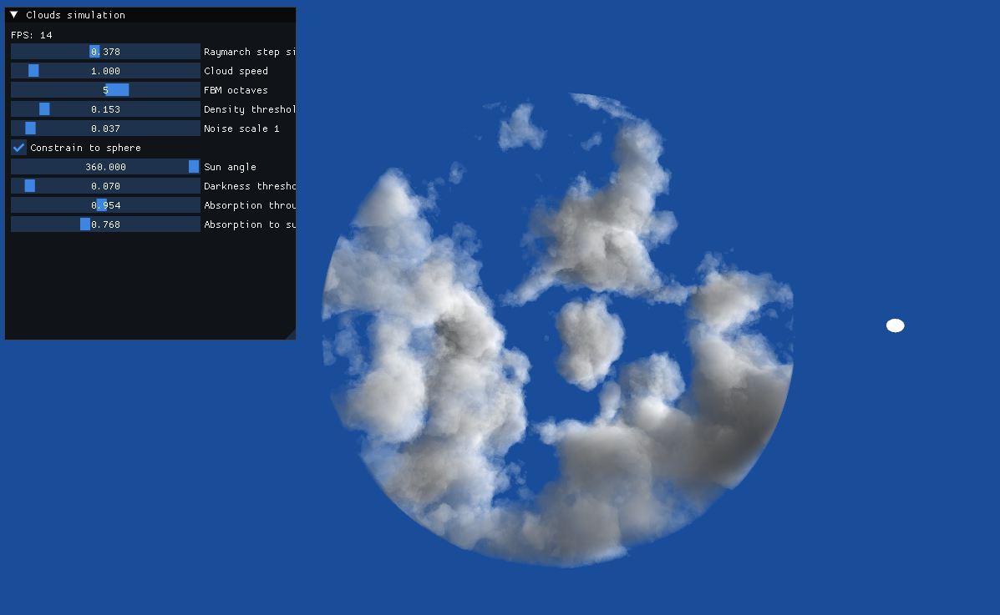
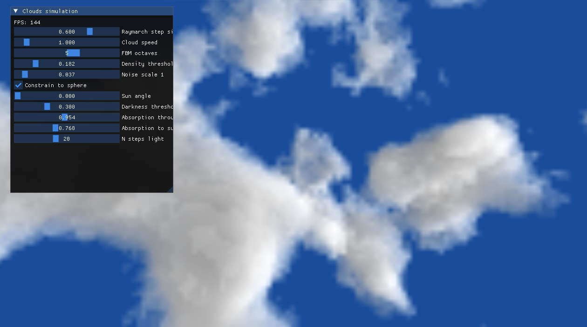

[..](../index.html)

# Raymarched clouds with OpenGL

- [Raymarching clouds](#1)
- [Adding light](#lighting)
- [Resources used](#res)

This is my final project for the [Graphics & Visualization](https://www.ntnu.edu/studies/courses/TDT4230) course at NTNU.

I used a lot of helpful resources that I'll be listing [at the bottom](#res) of this article.

# <a name="1"></a>Raymarching clouds

Raymarching consists of sending rays to the scene to render it. So for each fragment (pixel), a ray is cast from the fragment's world position using the camera's view direction. At a fixed `stepSize` interval, we compute a density along the ray.

After setting up the project, I started by trying to raymarch a sphere inside a cube. I used a sphere Signed Distance Function (SDF) to know if a point is inside of the sphere or not. All of the raymarching is happening inside the `cloud.frag` fragment shader used for rendering the cube.

<figure style="display: inline-block">

<figcaption>red if we hit the sphere, white if not</figcaption>
</figure>
<figure style="display: inline-block">

<figcaption>red if we hit the sphere, transparent if not</figcaption>
</figure>

This is what the stripped down algorithm looks like:

```
vec4 raymarch(vec3 ro, vec3 rd) {

    float depth = 0.0;
    vec4 res = vec4(0.0);

    for (int i = 0; i < maxSteps; i++) {

        // Compute current position
        vec3 p = ro + depth * rd;

        float density = computeDensity(p);

		float planeDensity = -sdPlane(p, vec3(0,1,0), -50);

		// Only draw the density if it's greater than 0
		if (density > 0.0) {

			vec4 color = vec4(mix(vec3(1.0,1.0,1.0), vec3(0.0, 0.0, 0.0), density), density );
			color.rgb *= color.a;
			res += color * (1.0 - res.a);
		}

        if (depth > maxDistance) {
            break; // Exit if ray marches too far
        }
    }

    return vec4(col, 1.0);
}

void main()
{
    // Ray origin (camera position)
    vec3 ro = cameraPos;

    // Ray direction (camera direction)
    vec3 rd = normalize(fragPos - ro);

    color = raymarch(ro, rd);
    
    // color = vec4(normal, 1.0);
}
```

Then, I took [this 3D simplex noise shader function by Nikita Miropolskiy](https://www.shadertoy.com/view/XsX3zB) to get 3D noise. This time, instead of asking if we are inside the sphere at a point `p`, we ask if the noise value at coordinates `p` is over a certain `threshold`.

<figure style="display: inline-block">

<figcaption>using a 3D simplex noise</figcaption>
</figure>

Adding density computation and .

<figure style="display: inline-block">

<figcaption>clouds in a cube!</figcaption>
</figure>
<figure style="display: inline-block">

<figcaption>inside the cube</figcaption>
</figure>

Then, I figured out it would be easier to render everything if we were always inside the cube: I just flipped the cube's faces sides so that they would render when we are inside the cube.

Adding a density threshold gave this result:

<figure style="display: inline-block">

<figcaption>using a density threshold</figcaption>
</figure>

<figure style="display: inline-block">

<figcaption>using a high stepSize</figcaption>
</figure>

Notice the "layering" artifact due to the raymarching `stepSize`. It disappears progressively as `stepSize` becomes lower.

The next step to achieve cloud-looking noise was to use a Fractal Brownian Motion (FBM) function. It basically means adding smaller and smaller noise to a noise. The `fbmOctaves` parameter defines the number of noises we add to the base one.

```
float fbm(vec3 p, int fbmOctaves, float speed, float noiseScale) {
	// Sample point
	vec3 q = p + time * speed * vec3(1.0f, -0.2f, -1.0f);

	// Base noise signal
	float g = simplex3d(q * noiseScale);

	float f = 0.0f;
	float scale = 0.5f;
	float factor = 2.02f;
	
	for (int i = 0; i < fbmOctaves; i++) {

		f += scale * simplex3d(q * noiseScale);

		q *= factor;
		factor += 0.21f;
		scale *= 0.5f; // Next noise will be 2 times smaller
	}

	return f;
}
```

For some reason I decided to use the sphere SDF to constrain the cloud inside a sphere. We have a more cloud looking shape now:

<figure style="display: inline-block">

<figcaption>cloud inside a sphere</figcaption>
</figure>

# <a name="lighting"></a>Adding light

I added a sun object to the simulation:

<figure style="display: inline-block">

</figure>

(explain lighting)

The lighting is dependent on the sun position, so I added a `sunAngle` uniform controllable in an ImGUI window.

<figure style="display: inline-block">

<figcaption>lighting parameters are now tweakable</figcaption>
</figure>

# <a name="opt"></a>Optimization

We already get decent results like this! The only problem is that the algorithms are run for each pixel, and that is 921600 pixels for a 720p window...

The solution here is to render the clouds at a smaller resolution. This will cut the number of pixels, and make the simulation faster.

The idea is to render the scene on a framebuffer texture at a certain percentage of the window size, then draw this texture on a quad.

<figure style="display: inline-block">

<figcaption>0.5x scale using linear filtering</figcaption>
</figure>

Notice the artifacts due to upscaling... This is because OpenGL only has linear filtering implemented natively. So I had to use bicubic filtering (more adapted to upscaling) to get better results.

The good thing is there are no noticeable differences between rendering at 1x or at 0.5x scale!

# <a name="res"></a>Resources used

- [Maxime Heckel - "Real-time dreamy Cloudscapes with Volumetric Raymarching"](https://blog.maximeheckel.com/posts/real-time-cloudscapes-with-volumetric-raymarching/)
- [LearnOpenGL - Framebuffers](https://learnopengl.com/Advanced-OpenGL/Framebuffers)
- [Inigo Quilez - SDF primitives](https://iquilezles.org/articles/distfunctions/)
- [NVIDIA Developer - Accurate Atmospheric Scattering](https://developer.nvidia.com/gpugems/gpugems2/part-ii-shading-lighting-and-shadows/chapter-16-accurate-atmospheric-scattering)
- [OpenGL Programming Guide - 3D Textures](https://learning.oreilly.com/library/view/opengl-programming-guide/9780132748445/ch08lev2sec16.html#ch08lev2sec16)
- [Kyle Kern - Atmospheric Scattering](https://calpoly-graphics.github.io/mixedrealitylab/project_websites/AtmosphericScatteringKyleKern/index.html)