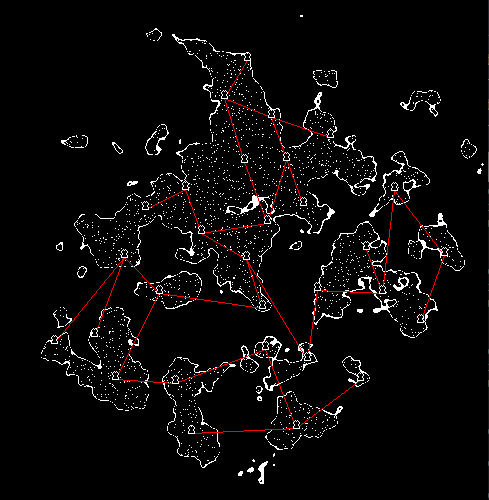

# *hello*

How did you end up here?

I'm writing little articles on programming experiments I make (sometimes).

I won't go into much detail, this especially acts as a log or journal.

---

### <a href="https://aedorian.github.io/blug/castles.md" target="_blank">Islands and castles generation</a>

Perlin noise generated island in `C++`. Castles placed using Poisson Disc Sampling. Small note on rendering pixel perfect with `SDL`.

---
